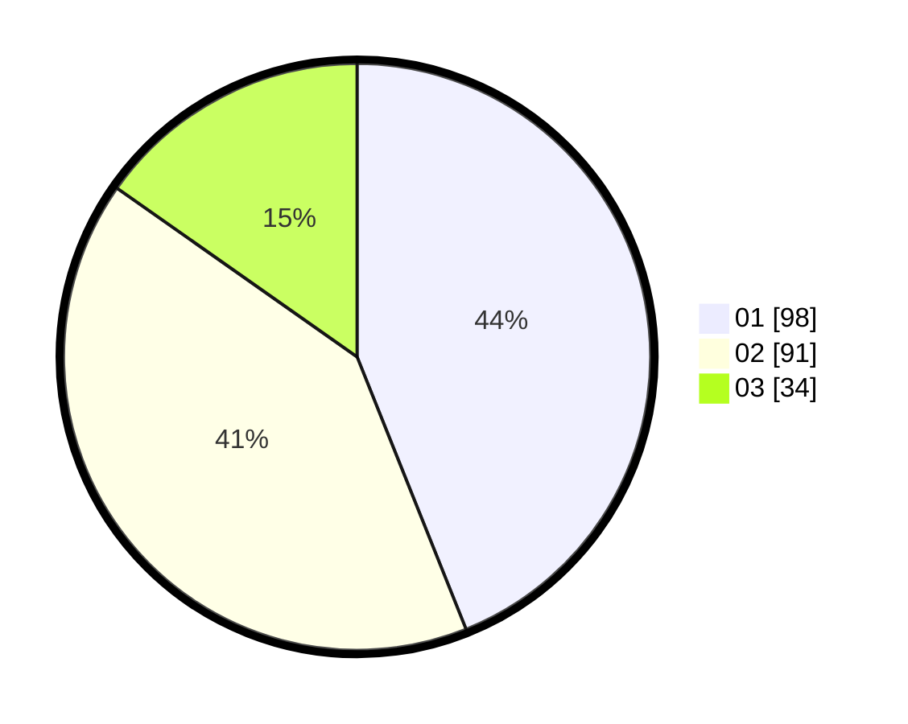

# Hasil

Hasil perolehan suara paslon dapat dilihat pada file paslon-01.txt, paslon-02.txt, dan paslon-03.txt.

Jika tidak ada, artinya data tersebut belum ada pada SIREKAP.

## Perolehan Suara

 * Paslon 01: **98**.
 * Paslon 02: **91**.
 * Paslon 03: **34**.

## Foto C Plano

https://sirekap-obj-formc.kpu.go.id/6d69/pemilu/ppwp/31/71/03/10/06/3171031006083-20240216-151908--5e2bd58b-6f81-4d4b-afe8-4c80b0cf3817.jpg

https://sirekap-obj-formc.kpu.go.id/6d69/pemilu/ppwp/31/71/03/10/06/3171031006083-20240216-151910--43338593-d897-4161-a934-da9925a6399a.jpg

https://sirekap-obj-formc.kpu.go.id/6d69/pemilu/ppwp/31/71/03/10/06/3171031006083-20240216-151909--750e1ede-0c44-4745-8aa4-2e6372dee3f5.jpg

## DATA PEMILIH TETAP

Jumlah pemilih dalam DPT: **272**.
 * L: **153**.
 * P: **119**.

## DATA PENGGUNA HAK PILIH

Jumlah pengguna hak pilih dalam DPT: **218**.
 * L: **109**.
 * P: **109**.

Jumlah pengguna hak pilih dalam DPTb: **6**.
 * L: **6**.
 * P: **0**.

Jumlah pengguna hak pilih dalam DPK: **2**.
 * L: **0**.
 * P: **2**.

Jumlah pengguna hak pilih: **226**.
 * L: **115**.
 * P: **111**.

## JUMLAH SUARA SAH DAN TIDAK SAH

JUMLAH SELURUH SUARA SAH: **223**.

JUMLAH SUARA TIDAK SAH: **3**.

JUMLAH SELURUH SUARA SAH DAN SUARA TIDAK SAH: **226**.
