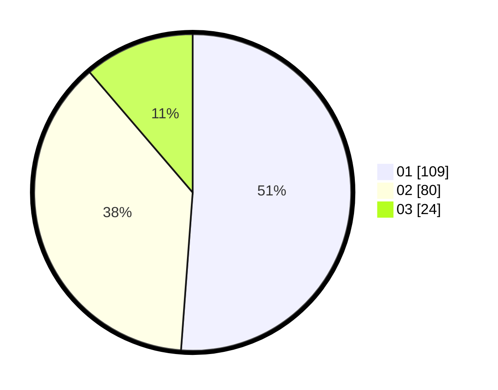

# Hasil

Hasil perolehan suara paslon dapat dilihat pada file paslon-01.txt, paslon-02.txt, dan paslon-03.txt.

Jika tidak ada, artinya data tersebut belum ada pada SIREKAP.

## Perolehan Suara

 * Paslon 01: **109**.
 * Paslon 02: **80**.
 * Paslon 03: **24**.

## Foto C Plano

https://sirekap-obj-formc.kpu.go.id/05f6/pemilu/ppwp/31/71/03/10/06/3171031006084-20240214-225411--00459299-c8ba-45fd-a29b-cef5d185b1cd.jpg

https://sirekap-obj-formc.kpu.go.id/05f6/pemilu/ppwp/31/71/03/10/06/3171031006084-20240215-010721--f2d1fb0a-ea57-4ce9-91d0-de10c0e0a59b.jpg

https://sirekap-obj-formc.kpu.go.id/05f6/pemilu/ppwp/31/71/03/10/06/3171031006084-20240214-225807--9801d4ca-896a-419f-bcb7-ef4f2844c682.jpg
