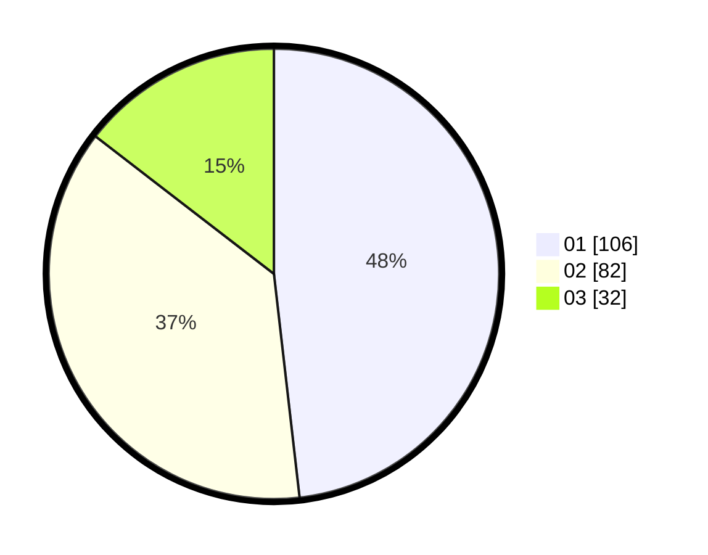

# Hasil

Hasil perolehan suara paslon dapat dilihat pada file paslon-01.txt, paslon-02.txt, dan paslon-03.txt.

Jika tidak ada, artinya data tersebut belum ada pada SIREKAP.

## Perolehan Suara

 * Paslon 01: **106**.
 * Paslon 02: **82**.
 * Paslon 03: **32**.

## Foto C Plano

https://sirekap-obj-formc.kpu.go.id/86c4/pemilu/ppwp/31/71/03/10/06/3171031006086-20240216-153612--4c11b96c-c4de-4f9c-ae93-24bbd2962b1d.jpg

https://sirekap-obj-formc.kpu.go.id/86c4/pemilu/ppwp/31/71/03/10/06/3171031006086-20240216-153614--c01e4afc-9afd-4d0a-b480-8e6e397daa80.jpg

https://sirekap-obj-formc.kpu.go.id/86c4/pemilu/ppwp/31/71/03/10/06/3171031006086-20240216-153613--e9305821-7e6b-4f12-bed0-5d83e65adde0.jpg

## DATA PEMILIH TETAP

Jumlah pemilih dalam DPT: **281**.
 * L: **131**.
 * P: **150**.

## DATA PENGGUNA HAK PILIH

Jumlah pengguna hak pilih dalam DPT: **220**.
 * L: **101**.
 * P: **119**.

Jumlah pengguna hak pilih dalam DPTb: **3**.
 * L: **1**.
 * P: **2**.

Jumlah pengguna hak pilih dalam DPK: **1**.
 * L: **1**.
 * P: **0**.

Jumlah pengguna hak pilih: **224**.
 * L: **103**.
 * P: **121**.

## JUMLAH SUARA SAH DAN TIDAK SAH

JUMLAH SELURUH SUARA SAH: **220**.

JUMLAH SUARA TIDAK SAH: **4**.

JUMLAH SELURUH SUARA SAH DAN SUARA TIDAK SAH: **224**.
