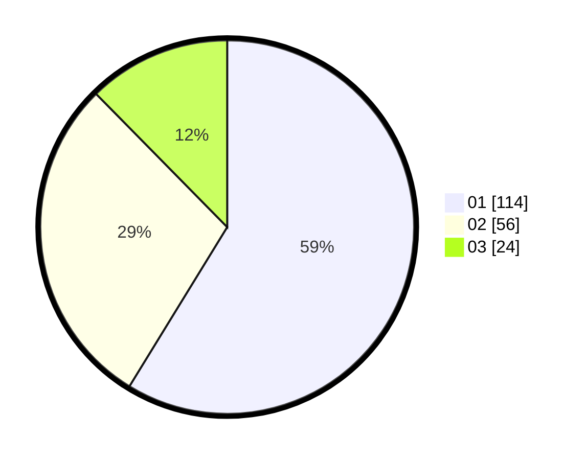

# Hasil

Hasil perolehan suara paslon dapat dilihat pada file paslon-01.txt, paslon-02.txt, dan paslon-03.txt.

Jika tidak ada, artinya data tersebut belum ada pada SIREKAP.

## Perolehan Suara

 * Paslon 01: **114**.
 * Paslon 02: **56**.
 * Paslon 03: **24**.

## Foto C Plano

https://sirekap-obj-formc.kpu.go.id/ed9a/pemilu/ppwp/31/71/03/10/06/3171031006090-20240215-213331--8e69b6b3-1c92-4fc2-9caf-6809dd21d6c4.jpg

https://sirekap-obj-formc.kpu.go.id/ed9a/pemilu/ppwp/31/71/03/10/06/3171031006090-20240215-213334--94dbb8eb-bdc4-41c0-8e7b-fa6360a93879.jpg

https://sirekap-obj-formc.kpu.go.id/ed9a/pemilu/ppwp/31/71/03/10/06/3171031006090-20240215-213332--c63dbd40-fea9-4a3e-b6c1-194c1924551c.jpg

## DATA PEMILIH TETAP

Jumlah pemilih dalam DPT: **270**.
 * L: **136**.
 * P: **134**.

## DATA PENGGUNA HAK PILIH

Jumlah pengguna hak pilih dalam DPT: **189**.
 * L: **99**.
 * P: **90**.

Jumlah pengguna hak pilih dalam DPTb: **4**.
 * L: **2**.
 * P: **2**.

Jumlah pengguna hak pilih dalam DPK: **1**.
 * L: **1**.
 * P: **0**.

Jumlah pengguna hak pilih: **194**.
 * L: **102**.
 * P: **92**.

## JUMLAH SUARA SAH DAN TIDAK SAH

JUMLAH SELURUH SUARA SAH: **194**.

JUMLAH SUARA TIDAK SAH: **0**.

JUMLAH SELURUH SUARA SAH DAN SUARA TIDAK SAH: **194**.
