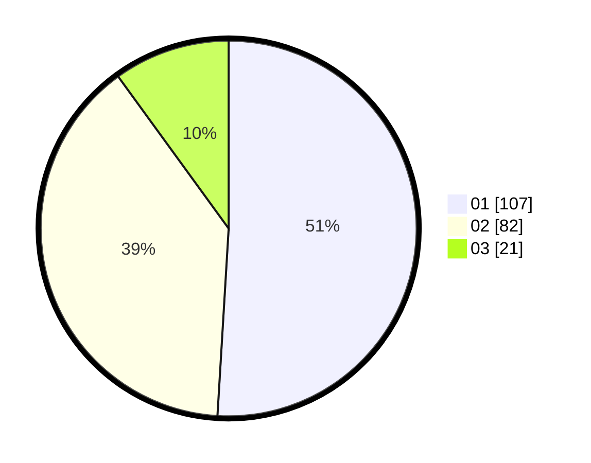

# Hasil

Hasil perolehan suara paslon dapat dilihat pada file paslon-01.txt, paslon-02.txt, dan paslon-03.txt.

Jika tidak ada, artinya data tersebut belum ada pada SIREKAP.

## Perolehan Suara

 * Paslon 01: **107**.
 * Paslon 02: **82**.
 * Paslon 03: **21**.

## Foto C Plano

https://sirekap-obj-formc.kpu.go.id/d0be/pemilu/ppwp/31/71/03/10/06/3171031006091-20240217-155711--6cdb00fd-dfdf-40ac-af6d-23d9d933489d.jpg

https://sirekap-obj-formc.kpu.go.id/d0be/pemilu/ppwp/31/71/03/10/06/3171031006091-20240217-154256--deb006fe-69ca-4e17-95d7-331e9d652b5a.jpg

https://sirekap-obj-formc.kpu.go.id/d0be/pemilu/ppwp/31/71/03/10/06/3171031006091-20240218-111947--46282889-654b-42bc-a914-b2482e147f60.jpg

## DATA PEMILIH TETAP

Jumlah pemilih dalam DPT: **269**.
 * L: **126**.
 * P: **143**.

## DATA PENGGUNA HAK PILIH

Jumlah pengguna hak pilih dalam DPT: **211**.
 * L: **98**.
 * P: **113**.

Jumlah pengguna hak pilih dalam DPTb: **0**.
 * L: **0**.
 * P: **0**.

Jumlah pengguna hak pilih dalam DPK: **0**.
 * L: **0**.
 * P: **0**.

Jumlah pengguna hak pilih: **211**.
 * L: **98**.
 * P: **113**.

## JUMLAH SUARA SAH DAN TIDAK SAH

JUMLAH SELURUH SUARA SAH: **210**.

JUMLAH SUARA TIDAK SAH: **1**.

JUMLAH SELURUH SUARA SAH DAN SUARA TIDAK SAH: **211**.
