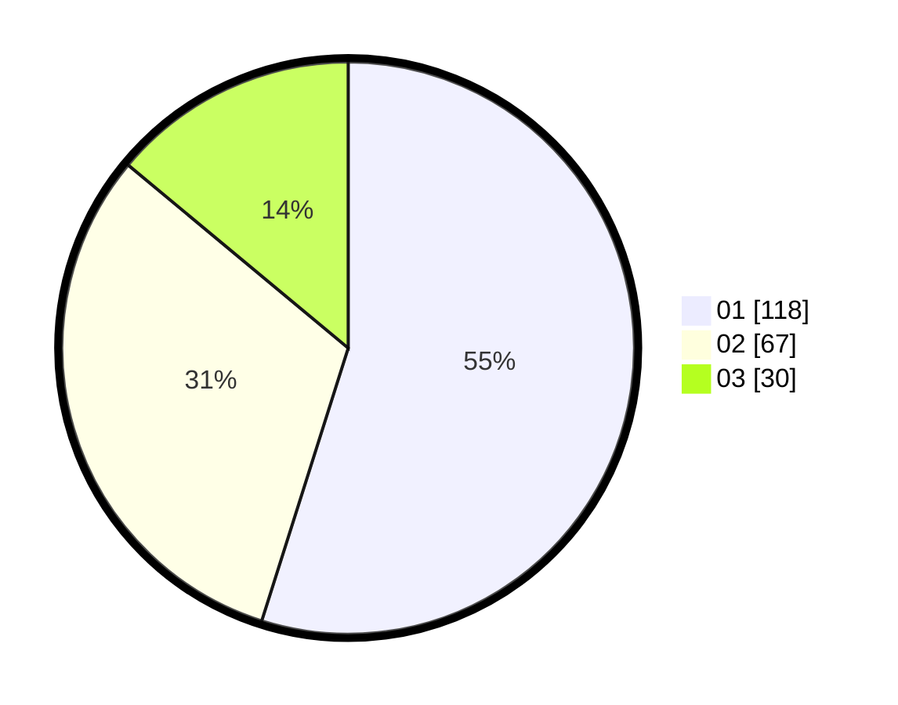

# Hasil

Hasil perolehan suara paslon dapat dilihat pada file paslon-01.txt, paslon-02.txt, dan paslon-03.txt.

Jika tidak ada, artinya data tersebut belum ada pada SIREKAP.

## Perolehan Suara

 * Paslon 01: **118**.
 * Paslon 02: **67**.
 * Paslon 03: **30**.

## Foto C Plano

https://sirekap-obj-formc.kpu.go.id/3106/pemilu/ppwp/31/71/03/10/06/3171031006093-20240216-150210--5af72b5b-d88a-456b-9a15-4bfadfdc5007.jpg

https://sirekap-obj-formc.kpu.go.id/3106/pemilu/ppwp/31/71/03/10/06/3171031006093-20240216-150212--1a6c8d9c-6bc2-447e-b063-b39b12888c5d.jpg

https://sirekap-obj-formc.kpu.go.id/3106/pemilu/ppwp/31/71/03/10/06/3171031006093-20240216-150211--edd7e04c-09c0-4975-9ff7-eb2fcbd7e7b8.jpg

## DATA PEMILIH TETAP

Jumlah pemilih dalam DPT: **270**.
 * L: **134**.
 * P: **136**.

## DATA PENGGUNA HAK PILIH

Jumlah pengguna hak pilih dalam DPT: **213**.
 * L: **100**.
 * P: **113**.

Jumlah pengguna hak pilih dalam DPTb: **3**.
 * L: **1**.
 * P: **2**.

Jumlah pengguna hak pilih dalam DPK: **1**.
 * L: **0**.
 * P: **1**.

Jumlah pengguna hak pilih: **217**.
 * L: **101**.
 * P: **116**.

## JUMLAH SUARA SAH DAN TIDAK SAH

JUMLAH SELURUH SUARA SAH: **215**.

JUMLAH SUARA TIDAK SAH: **2**.

JUMLAH SELURUH SUARA SAH DAN SUARA TIDAK SAH: **217**.
