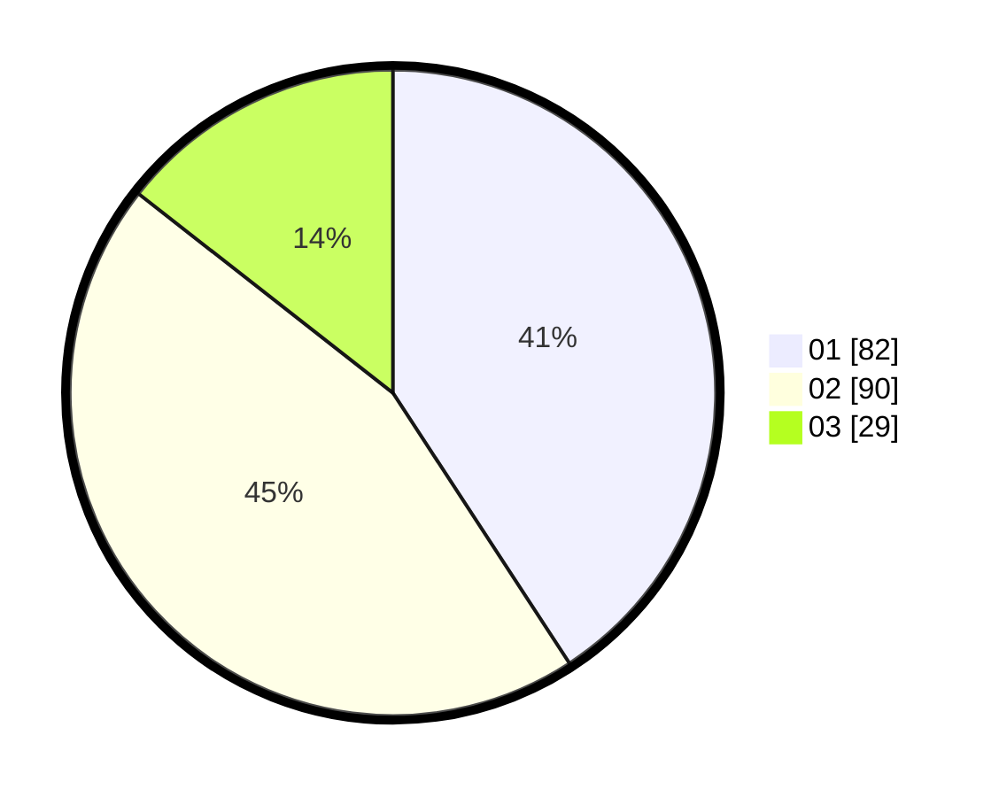

# Hasil

Hasil perolehan suara paslon dapat dilihat pada file paslon-01.txt, paslon-02.txt, dan paslon-03.txt.

Jika tidak ada, artinya data tersebut belum ada pada SIREKAP.

## Perolehan Suara

 * Paslon 01: **82**.
 * Paslon 02: **90**.
 * Paslon 03: **29**.

## Foto C Plano

https://sirekap-obj-formc.kpu.go.id/a773/pemilu/ppwp/31/71/03/10/06/3171031006094-20240217-163624--85417b41-ab63-4429-bb76-af41ce0ef35c.jpg

https://sirekap-obj-formc.kpu.go.id/a773/pemilu/ppwp/31/71/03/10/06/3171031006094-20240217-163627--adaeb520-f610-4432-b4a9-293d779ab469.jpg

https://sirekap-obj-formc.kpu.go.id/a773/pemilu/ppwp/31/71/03/10/06/3171031006094-20240217-163626--c1a51f4f-f983-4724-8a86-b0c9dd8cf954.jpg

## DATA PEMILIH TETAP

Jumlah pemilih dalam DPT: **266**.
 * L: **128**.
 * P: **138**.

## DATA PENGGUNA HAK PILIH

Jumlah pengguna hak pilih dalam DPT: **198**.
 * L: **86**.
 * P: **112**.

Jumlah pengguna hak pilih dalam DPTb: **0**.
 * L: **0**.
 * P: **0**.

Jumlah pengguna hak pilih dalam DPK: **7**.
 * L: **2**.
 * P: **5**.

Jumlah pengguna hak pilih: **205**.
 * L: **88**.
 * P: **117**.

## JUMLAH SUARA SAH DAN TIDAK SAH

JUMLAH SELURUH SUARA SAH: **201**.

JUMLAH SUARA TIDAK SAH: **4**.

JUMLAH SELURUH SUARA SAH DAN SUARA TIDAK SAH: **205**.
