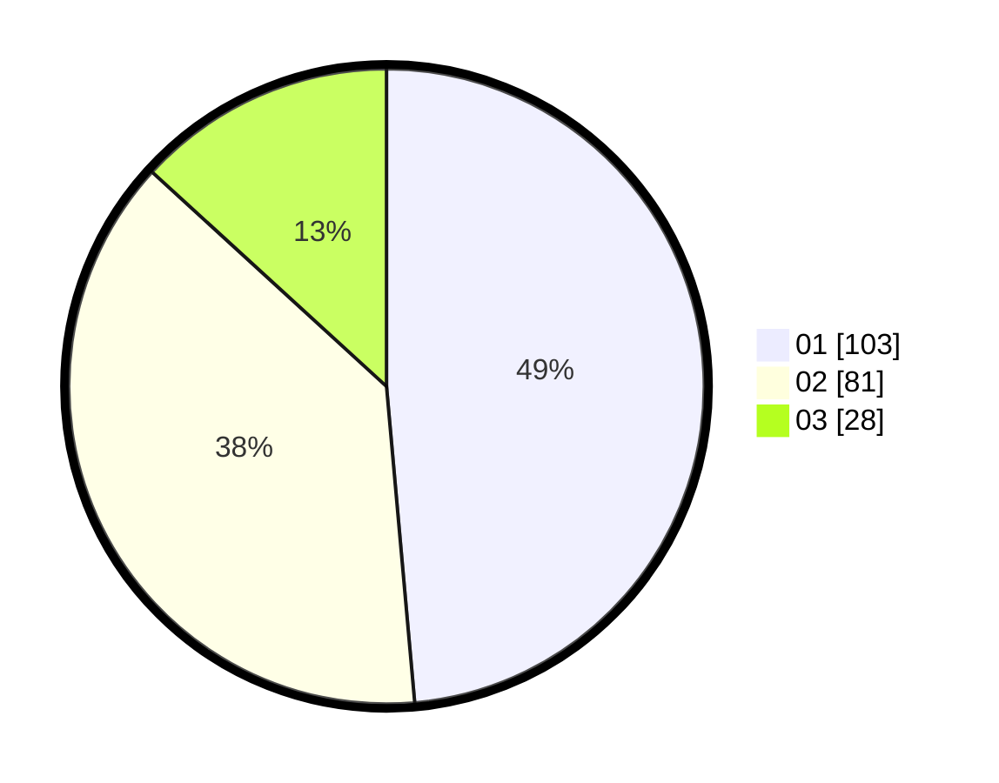

# Hasil

Hasil perolehan suara paslon dapat dilihat pada file paslon-01.txt, paslon-02.txt, dan paslon-03.txt.

Jika tidak ada, artinya data tersebut belum ada pada SIREKAP.

## Perolehan Suara

 * Paslon 01: **103**.
 * Paslon 02: **81**.
 * Paslon 03: **28**.

## Foto C Plano

https://sirekap-obj-formc.kpu.go.id/680c/pemilu/ppwp/31/71/03/10/06/3171031006095-20240217-230326--174ba210-0e9b-4784-858a-6b242e97b19b.jpg

https://sirekap-obj-formc.kpu.go.id/680c/pemilu/ppwp/31/71/03/10/06/3171031006095-20240217-230327--92daf79e-fa70-4268-9c07-30d97b80337a.jpg

https://sirekap-obj-formc.kpu.go.id/680c/pemilu/ppwp/31/71/03/10/06/3171031006095-20240217-230327--11cd2a1e-fb1d-450b-aabb-4dd071d89ee6.jpg

## DATA PEMILIH TETAP

Jumlah pemilih dalam DPT: **258**.
 * L: **125**.
 * P: **133**.

## DATA PENGGUNA HAK PILIH

Jumlah pengguna hak pilih dalam DPT: **203**.
 * L: **100**.
 * P: **103**.

Jumlah pengguna hak pilih dalam DPTb: **4**.
 * L: **1**.
 * P: **3**.

Jumlah pengguna hak pilih dalam DPK: **7**.
 * L: **5**.
 * P: **2**.

Jumlah pengguna hak pilih: **214**.
 * L: **106**.
 * P: **108**.

## JUMLAH SUARA SAH DAN TIDAK SAH

JUMLAH SELURUH SUARA SAH: **212**.

JUMLAH SUARA TIDAK SAH: **2**.

JUMLAH SELURUH SUARA SAH DAN SUARA TIDAK SAH: **214**.
