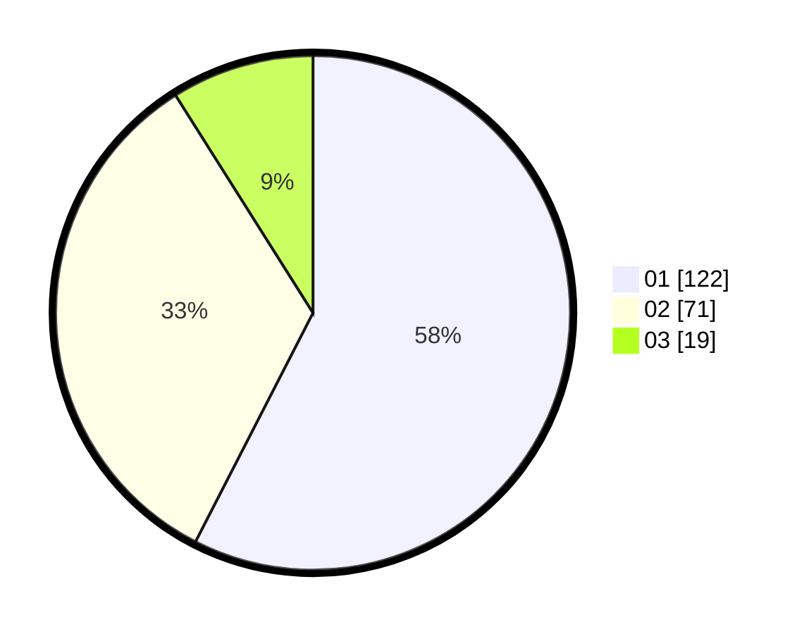

# Hasil

Hasil perolehan suara paslon dapat dilihat pada file paslon-01.txt, paslon-02.txt, dan paslon-03.txt.

Jika tidak ada, artinya data tersebut belum ada pada SIREKAP.

## Perolehan Suara

 * Paslon 01: **122**.
 * Paslon 02: **71**.
 * Paslon 03: **19**.

## Foto C Plano

https://sirekap-obj-formc.kpu.go.id/90ef/pemilu/ppwp/31/71/03/10/06/3171031006097-20240216-175807--15a78d83-b8f2-4eca-ba82-9a4bd6d61bab.jpg

https://sirekap-obj-formc.kpu.go.id/90ef/pemilu/ppwp/31/71/03/10/06/3171031006097-20240216-175809--f083eadd-34a5-41ff-985e-b7b370699b66.jpg

https://sirekap-obj-formc.kpu.go.id/90ef/pemilu/ppwp/31/71/03/10/06/3171031006097-20240216-175808--f41fa310-f075-4b6c-a9da-6a0522533138.jpg

## DATA PEMILIH TETAP

Jumlah pemilih dalam DPT: **262**.
 * L: **131**.
 * P: **131**.

## DATA PENGGUNA HAK PILIH

Jumlah pengguna hak pilih dalam DPT: **207**.
 * L: **102**.
 * P: **105**.

Jumlah pengguna hak pilih dalam DPTb: **5**.
 * L: **2**.
 * P: **3**.

Jumlah pengguna hak pilih dalam DPK: **3**.
 * L: **1**.
 * P: **2**.

Jumlah pengguna hak pilih: **215**.
 * L: **105**.
 * P: **110**.

## JUMLAH SUARA SAH DAN TIDAK SAH

JUMLAH SELURUH SUARA SAH: **212**.

JUMLAH SUARA TIDAK SAH: **3**.

JUMLAH SELURUH SUARA SAH DAN SUARA TIDAK SAH: **215**.
