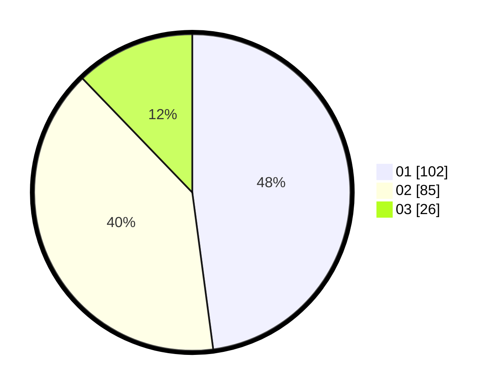

# Hasil

Hasil perolehan suara paslon dapat dilihat pada file paslon-01.txt, paslon-02.txt, dan paslon-03.txt.

Jika tidak ada, artinya data tersebut belum ada pada SIREKAP.

## Perolehan Suara

 * Paslon 01: **102**.
 * Paslon 02: **85**.
 * Paslon 03: **26**.

## Foto C Plano

https://sirekap-obj-formc.kpu.go.id/ee23/pemilu/ppwp/31/71/03/10/06/3171031006099-20240216-162336--e7da50f9-a021-48a3-9824-3dc2f9460683.jpg

https://sirekap-obj-formc.kpu.go.id/ee23/pemilu/ppwp/31/71/03/10/06/3171031006099-20240216-162337--967d9071-ab1e-4516-9a56-c894a075cc29.jpg

https://sirekap-obj-formc.kpu.go.id/ee23/pemilu/ppwp/31/71/03/10/06/3171031006099-20240216-162336--fcec4811-14d2-4b6d-88db-8d3d942c9111.jpg

## DATA PEMILIH TETAP

Jumlah pemilih dalam DPT: **268**.
 * L: **137**.
 * P: **131**.

## DATA PENGGUNA HAK PILIH

Jumlah pengguna hak pilih dalam DPT: **217**.
 * L: **112**.
 * P: **105**.

Jumlah pengguna hak pilih dalam DPTb: **0**.
 * L: **0**.
 * P: **0**.

Jumlah pengguna hak pilih dalam DPK: **0**.
 * L: **0**.
 * P: **0**.

Jumlah pengguna hak pilih: **217**.
 * L: **112**.
 * P: **105**.

## JUMLAH SUARA SAH DAN TIDAK SAH

JUMLAH SELURUH SUARA SAH: **213**.

JUMLAH SUARA TIDAK SAH: **4**.

JUMLAH SELURUH SUARA SAH DAN SUARA TIDAK SAH: **217**.
