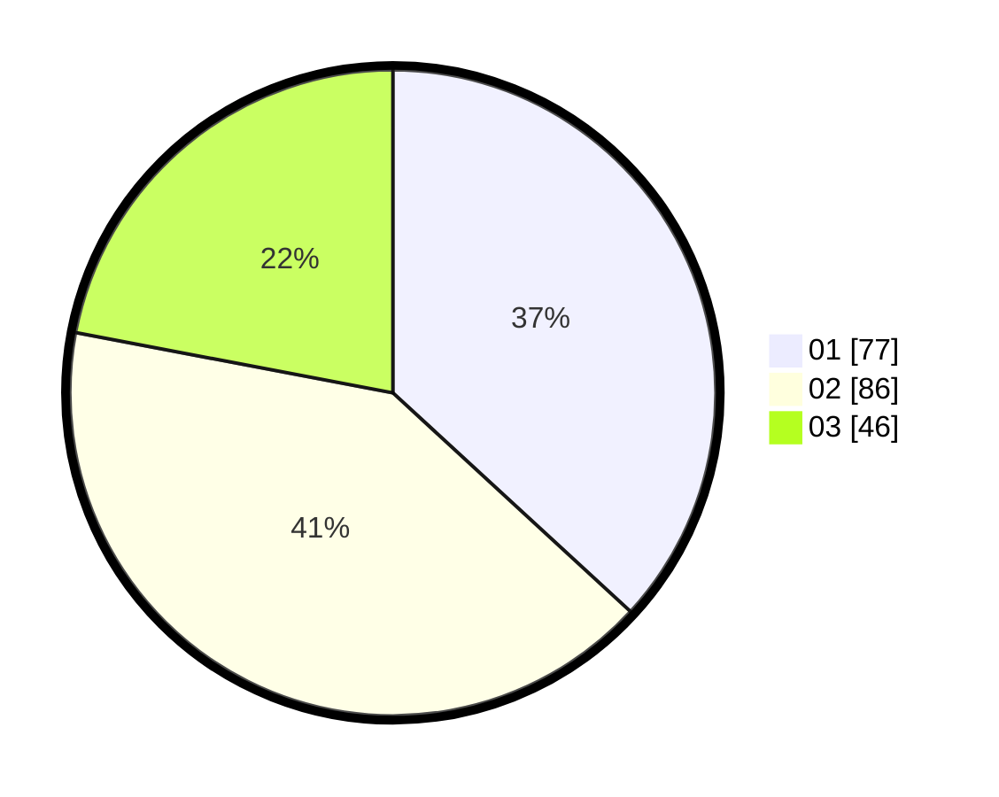

# Hasil

Hasil perolehan suara paslon dapat dilihat pada file paslon-01.txt, paslon-02.txt, dan paslon-03.txt.

Jika tidak ada, artinya data tersebut belum ada pada SIREKAP.

## Perolehan Suara

 * Paslon 01: **77**.
 * Paslon 02: **86**.
 * Paslon 03: **46**.

## Foto C Plano

https://sirekap-obj-formc.kpu.go.id/f3c5/pemilu/ppwp/31/71/03/10/07/3171031007001-20240216-214624--5b338e78-527e-4c07-9b7c-a2900cb0e5a6.jpg

https://sirekap-obj-formc.kpu.go.id/f3c5/pemilu/ppwp/31/71/03/10/07/3171031007001-20240216-214626--efc5a092-556c-4060-a7e5-39520aa91aae.jpg

https://sirekap-obj-formc.kpu.go.id/f3c5/pemilu/ppwp/31/71/03/10/07/3171031007001-20240216-214625--825d3a02-12a8-4caa-9f8d-62c6baab9467.jpg

## DATA PEMILIH TETAP

Jumlah pemilih dalam DPT: **266**.
 * L: **134**.
 * P: **132**.

## DATA PENGGUNA HAK PILIH

Jumlah pengguna hak pilih dalam DPT: **213**.
 * L: **105**.
 * P: **108**.

Jumlah pengguna hak pilih dalam DPTb: **2**.
 * L: **1**.
 * P: **1**.

Jumlah pengguna hak pilih dalam DPK: **0**.
 * L: **0**.
 * P: **0**.

Jumlah pengguna hak pilih: **215**.
 * L: **106**.
 * P: **109**.

## JUMLAH SUARA SAH DAN TIDAK SAH

JUMLAH SELURUH SUARA SAH: **209**.

JUMLAH SUARA TIDAK SAH: **6**.

JUMLAH SELURUH SUARA SAH DAN SUARA TIDAK SAH: **215**.
