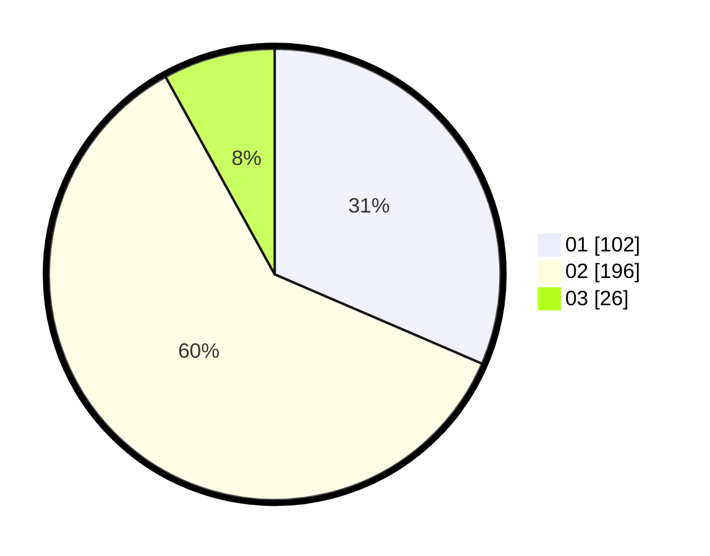

# Hasil

Hasil perolehan suara paslon dapat dilihat pada file paslon-01.txt, paslon-02.txt, dan paslon-03.txt.

Jika tidak ada, artinya data tersebut belum ada pada SIREKAP.

## Perolehan Suara

 * Paslon 01: **102**.
 * Paslon 02: **196**.
 * Paslon 03: **26**.

## Foto C Plano

https://sirekap-obj-formc.kpu.go.id/4bc6/pemilu/ppwp/31/71/03/10/07/3171031007003-20240216-082910--6243aeea-eeb4-4177-9f7d-12f52bcbb12b.jpg

https://sirekap-obj-formc.kpu.go.id/4bc6/pemilu/ppwp/31/71/03/10/07/3171031007003-20240216-082913--5f64ff5f-344f-4016-a285-2e30e4710c75.jpg

https://sirekap-obj-formc.kpu.go.id/4bc6/pemilu/ppwp/31/71/03/10/07/3171031007003-20240216-082912--278844bd-3785-4122-8271-5ea0bf16d3a8.jpg

## DATA PEMILIH TETAP

Jumlah pemilih dalam DPT: **274**.
 * L: **138**.
 * P: **136**.

## DATA PENGGUNA HAK PILIH

Jumlah pengguna hak pilih dalam DPT: **226**.
 * L: **112**.
 * P: **114**.

Jumlah pengguna hak pilih dalam DPTb: **1**.
 * L: **1**.
 * P: **0**.

Jumlah pengguna hak pilih dalam DPK: **0**.
 * L: **0**.
 * P: **0**.

Jumlah pengguna hak pilih: **227**.
 * L: **113**.
 * P: **114**.

## JUMLAH SUARA SAH DAN TIDAK SAH

JUMLAH SELURUH SUARA SAH: **224**.

JUMLAH SUARA TIDAK SAH: **3**.

JUMLAH SELURUH SUARA SAH DAN SUARA TIDAK SAH: **227**.
