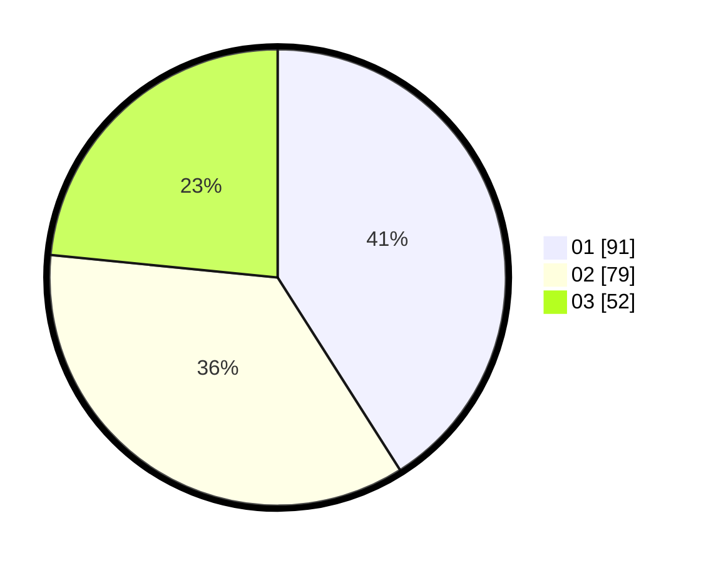

# Hasil

Hasil perolehan suara paslon dapat dilihat pada file paslon-01.txt, paslon-02.txt, dan paslon-03.txt.

Jika tidak ada, artinya data tersebut belum ada pada SIREKAP.

## Perolehan Suara

 * Paslon 01: **91**.
 * Paslon 02: **79**.
 * Paslon 03: **52**.

## Foto C Plano

https://sirekap-obj-formc.kpu.go.id/eafc/pemilu/ppwp/31/71/03/10/07/3171031007006-20240214-195722--872dc626-e2ff-4000-b8f2-b1c6e3efc95c.jpg

https://sirekap-obj-formc.kpu.go.id/eafc/pemilu/ppwp/31/71/03/10/07/3171031007006-20240214-200428--b4494463-bc45-4654-8e2d-4354797faab9.jpg

https://sirekap-obj-formc.kpu.go.id/eafc/pemilu/ppwp/31/71/03/10/07/3171031007006-20240214-221311--de0fb83a-aac6-4812-8394-638d241deb8d.jpg

## DATA PEMILIH TETAP

Jumlah pemilih dalam DPT: **247**.
 * L: **117**.
 * P: **130**.

## DATA PENGGUNA HAK PILIH

Jumlah pengguna hak pilih dalam DPT: **222**.
 * L: **102**.
 * P: **120**.

Jumlah pengguna hak pilih dalam DPTb: **1**.
 * L: **0**.
 * P: **1**.

Jumlah pengguna hak pilih dalam DPK: **1**.
 * L: **0**.
 * P: **1**.

Jumlah pengguna hak pilih: **224**.
 * L: **102**.
 * P: **122**.

## JUMLAH SUARA SAH DAN TIDAK SAH

JUMLAH SELURUH SUARA SAH: **222**.

JUMLAH SUARA TIDAK SAH: **2**.

JUMLAH SELURUH SUARA SAH DAN SUARA TIDAK SAH: **224**.
