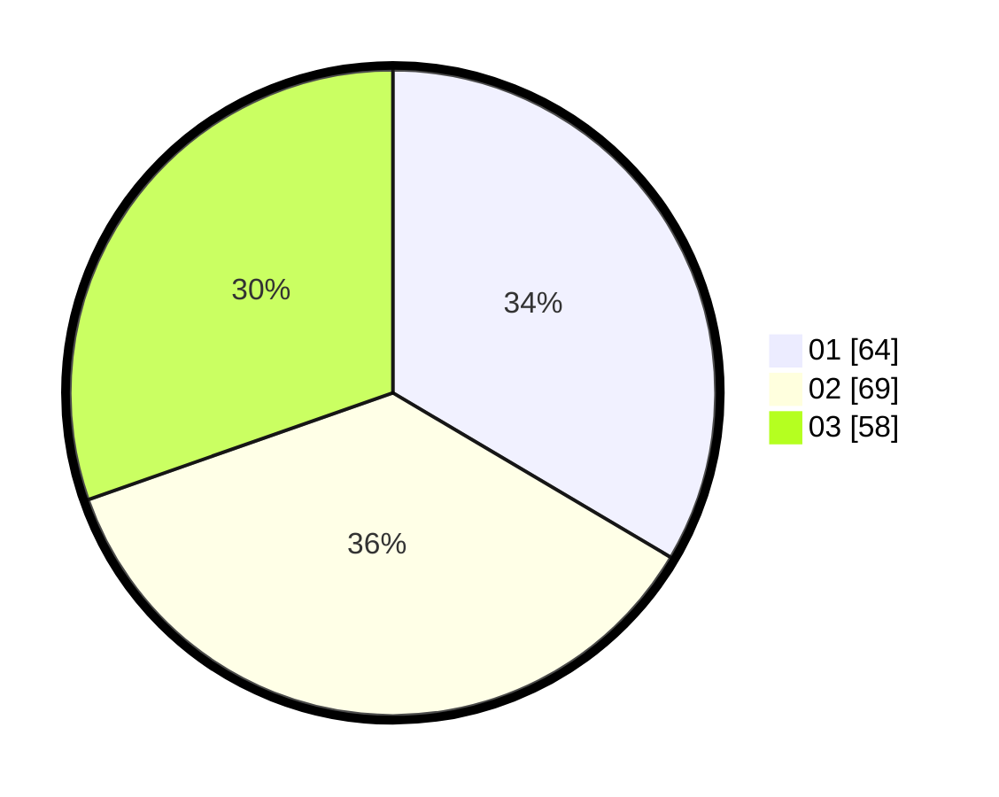

# Hasil

Hasil perolehan suara paslon dapat dilihat pada file paslon-01.txt, paslon-02.txt, dan paslon-03.txt.

Jika tidak ada, artinya data tersebut belum ada pada SIREKAP.

## Perolehan Suara

 * Paslon 01: **64**.
 * Paslon 02: **69**.
 * Paslon 03: **58**.

## Foto C Plano

https://sirekap-obj-formc.kpu.go.id/d5d3/pemilu/ppwp/31/71/03/10/07/3171031007007-20240214-201708--9f28aeee-679b-4d2f-a958-469b0993427b.jpg

https://sirekap-obj-formc.kpu.go.id/d5d3/pemilu/ppwp/31/71/03/10/07/3171031007007-20240216-141123--9ef0d170-c86e-48d1-ba1b-6f6c970abd2c.jpg

https://sirekap-obj-formc.kpu.go.id/d5d3/pemilu/ppwp/31/71/03/10/07/3171031007007-20240216-141122--7d256f89-11d5-4636-bf35-8aa7edc67981.jpg

## DATA PEMILIH TETAP

Jumlah pemilih dalam DPT: **237**.
 * L: **118**.
 * P: **119**.

## DATA PENGGUNA HAK PILIH

Jumlah pengguna hak pilih dalam DPT: **189**.
 * L: **91**.
 * P: **98**.

Jumlah pengguna hak pilih dalam DPTb: **3**.
 * L: **1**.
 * P: **2**.

Jumlah pengguna hak pilih dalam DPK: **4**.
 * L: **2**.
 * P: **2**.

Jumlah pengguna hak pilih: **196**.
 * L: **94**.
 * P: **102**.

## JUMLAH SUARA SAH DAN TIDAK SAH

JUMLAH SELURUH SUARA SAH: **191**.

JUMLAH SUARA TIDAK SAH: **5**.

JUMLAH SELURUH SUARA SAH DAN SUARA TIDAK SAH: **196**.
