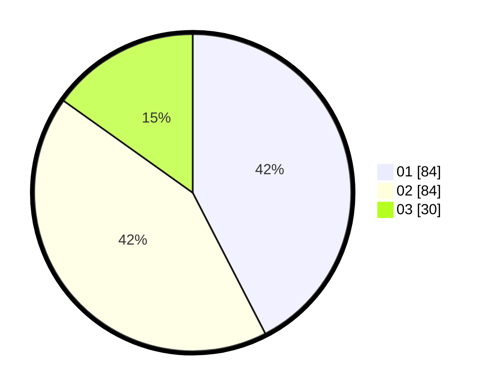

# Hasil

Hasil perolehan suara paslon dapat dilihat pada file paslon-01.txt, paslon-02.txt, dan paslon-03.txt.

Jika tidak ada, artinya data tersebut belum ada pada SIREKAP.

## Perolehan Suara

 * Paslon 01: **84**.
 * Paslon 02: **84**.
 * Paslon 03: **30**.

## Foto C Plano

https://sirekap-obj-formc.kpu.go.id/b568/pemilu/ppwp/31/71/03/10/07/3171031007008-20240214-213120--006f3286-30b5-4675-969e-a83088e92a92.jpg

https://sirekap-obj-formc.kpu.go.id/b568/pemilu/ppwp/31/71/03/10/07/3171031007008-20240214-213218--9429afd2-fbbf-4d8a-bb85-a0e85a39966b.jpg

https://sirekap-obj-formc.kpu.go.id/b568/pemilu/ppwp/31/71/03/10/07/3171031007008-20240214-213304--f584f348-094e-438f-ba08-db1e662870f0.jpg

## DATA PEMILIH TETAP

Jumlah pemilih dalam DPT: **202**.
 * L: **96**.
 * P: **106**.

## DATA PENGGUNA HAK PILIH

Jumlah pengguna hak pilih dalam DPT: **201**.
 * L: **96**.
 * P: **105**.

Jumlah pengguna hak pilih dalam DPTb: **0**.
 * L: **0**.
 * P: **0**.

Jumlah pengguna hak pilih dalam DPK: **1**.
 * L: **0**.
 * P: **1**.

Jumlah pengguna hak pilih: **202**.
 * L: **96**.
 * P: **106**.

## JUMLAH SUARA SAH DAN TIDAK SAH

JUMLAH SELURUH SUARA SAH: **198**.

JUMLAH SUARA TIDAK SAH: **4**.

JUMLAH SELURUH SUARA SAH DAN SUARA TIDAK SAH: **202**.
