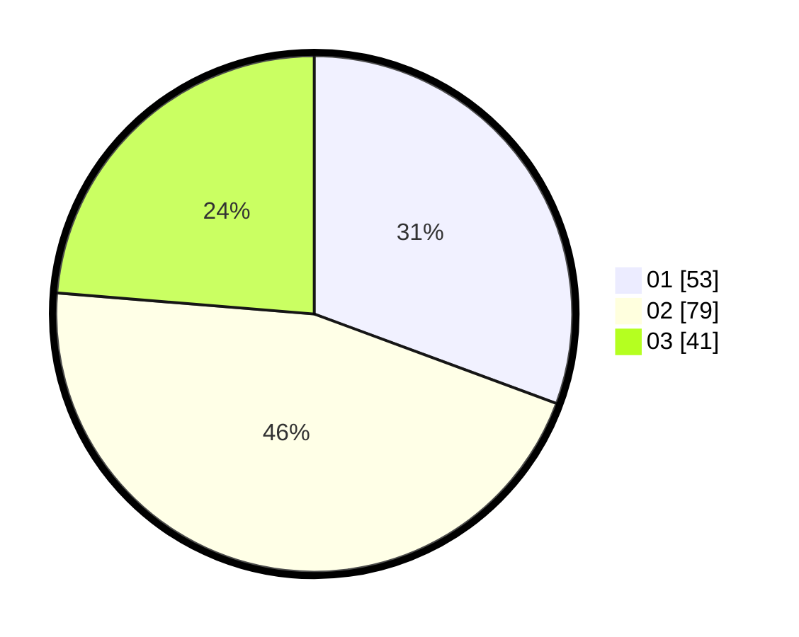

# Hasil

Hasil perolehan suara paslon dapat dilihat pada file paslon-01.txt, paslon-02.txt, dan paslon-03.txt.

Jika tidak ada, artinya data tersebut belum ada pada SIREKAP.

## Perolehan Suara

 * Paslon 01: **53**.
 * Paslon 02: **79**.
 * Paslon 03: **41**.

## Foto C Plano

https://sirekap-obj-formc.kpu.go.id/28b5/pemilu/ppwp/31/71/03/10/07/3171031007012-20240214-155229--3104b979-592d-4f68-ae2d-38d9bd2b5aa1.jpg

https://sirekap-obj-formc.kpu.go.id/28b5/pemilu/ppwp/31/71/03/10/07/3171031007012-20240214-155233--5499caba-3f62-4cdf-83b0-6489b95ac080.jpg

https://sirekap-obj-formc.kpu.go.id/28b5/pemilu/ppwp/31/71/03/10/07/3171031007012-20240214-155237--c844d594-0bd2-4a3a-b5ad-08e16fd52b4b.jpg

## DATA PEMILIH TETAP

Jumlah pemilih dalam DPT: **256**.
 * L: **121**.
 * P: **135**.

## DATA PENGGUNA HAK PILIH

Jumlah pengguna hak pilih dalam DPT: **173**.
 * L: **75**.
 * P: **98**.

Jumlah pengguna hak pilih dalam DPTb: **4**.
 * L: **2**.
 * P: **2**.

Jumlah pengguna hak pilih dalam DPK: **0**.
 * L: **0**.
 * P: **0**.

Jumlah pengguna hak pilih: **177**.
 * L: **77**.
 * P: **100**.

## JUMLAH SUARA SAH DAN TIDAK SAH

JUMLAH SELURUH SUARA SAH: **173**.

JUMLAH SUARA TIDAK SAH: **4**.

JUMLAH SELURUH SUARA SAH DAN SUARA TIDAK SAH: **177**.
