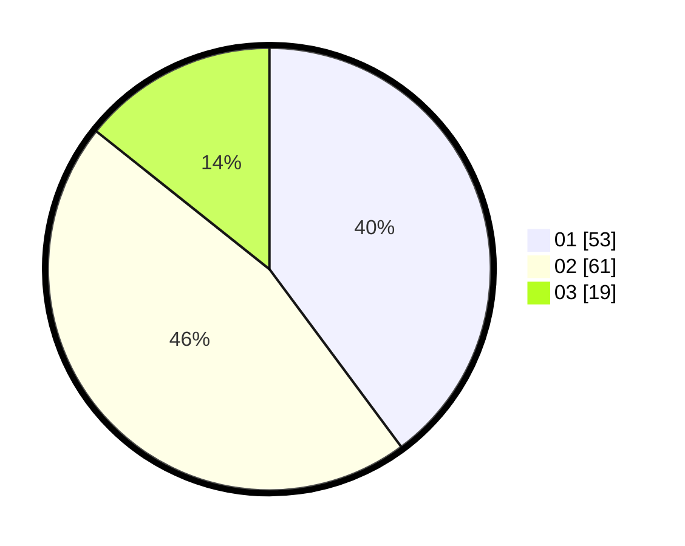

# Hasil

Hasil perolehan suara paslon dapat dilihat pada file paslon-01.txt, paslon-02.txt, dan paslon-03.txt.

Jika tidak ada, artinya data tersebut belum ada pada SIREKAP.

## Perolehan Suara

 * Paslon 01: **53**.
 * Paslon 02: **61**.
 * Paslon 03: **19**.

## Foto C Plano

https://sirekap-obj-formc.kpu.go.id/0a49/pemilu/ppwp/31/71/03/10/07/3171031007013-20240214-192904--c38f49e3-eea2-477e-a6b2-770f12bb53f6.jpg

https://sirekap-obj-formc.kpu.go.id/0a49/pemilu/ppwp/31/71/03/10/07/3171031007013-20240214-162244--ae06e03e-408f-4014-86ae-ce839e12dd10.jpg
