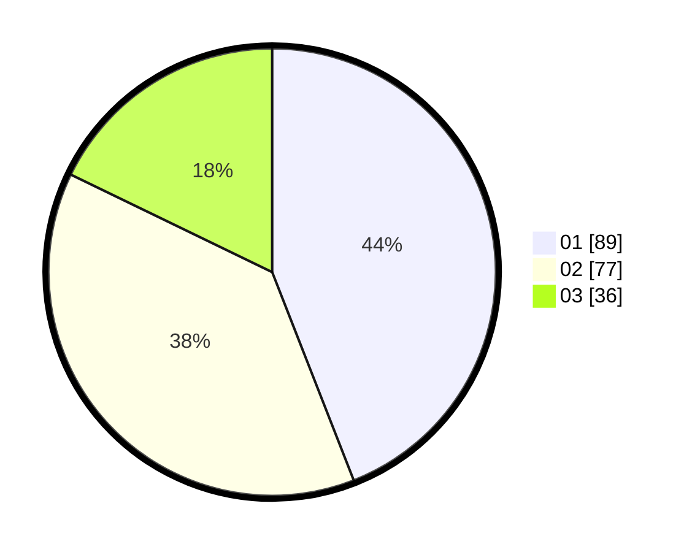

# Hasil

Hasil perolehan suara paslon dapat dilihat pada file paslon-01.txt, paslon-02.txt, dan paslon-03.txt.

Jika tidak ada, artinya data tersebut belum ada pada SIREKAP.

## Perolehan Suara

 * Paslon 01: **89**.
 * Paslon 02: **77**.
 * Paslon 03: **36**.

## Foto C Plano

https://sirekap-obj-formc.kpu.go.id/ee83/pemilu/ppwp/31/71/03/10/07/3171031007014-20240215-204418--690f24b7-d836-446b-acc8-15a9e214aee5.jpg

https://sirekap-obj-formc.kpu.go.id/ee83/pemilu/ppwp/31/71/03/10/07/3171031007014-20240215-204420--cd842e5b-b26f-4868-9308-fdd27cfec408.jpg

https://sirekap-obj-formc.kpu.go.id/ee83/pemilu/ppwp/31/71/03/10/07/3171031007014-20240215-204419--362cfc68-6fbe-4cb0-adf7-7d97d0982ca7.jpg

## DATA PEMILIH TETAP

Jumlah pemilih dalam DPT: **257**.
 * L: **119**.
 * P: **138**.

## DATA PENGGUNA HAK PILIH

Jumlah pengguna hak pilih dalam DPT: **198**.
 * L: **82**.
 * P: **116**.

Jumlah pengguna hak pilih dalam DPTb: **2**.
 * L: **1**.
 * P: **1**.

Jumlah pengguna hak pilih dalam DPK: **7**.
 * L: **3**.
 * P: **4**.

Jumlah pengguna hak pilih: **207**.
 * L: **86**.
 * P: **121**.

## JUMLAH SUARA SAH DAN TIDAK SAH

JUMLAH SELURUH SUARA SAH: **202**.

JUMLAH SUARA TIDAK SAH: **5**.

JUMLAH SELURUH SUARA SAH DAN SUARA TIDAK SAH: **207**.
