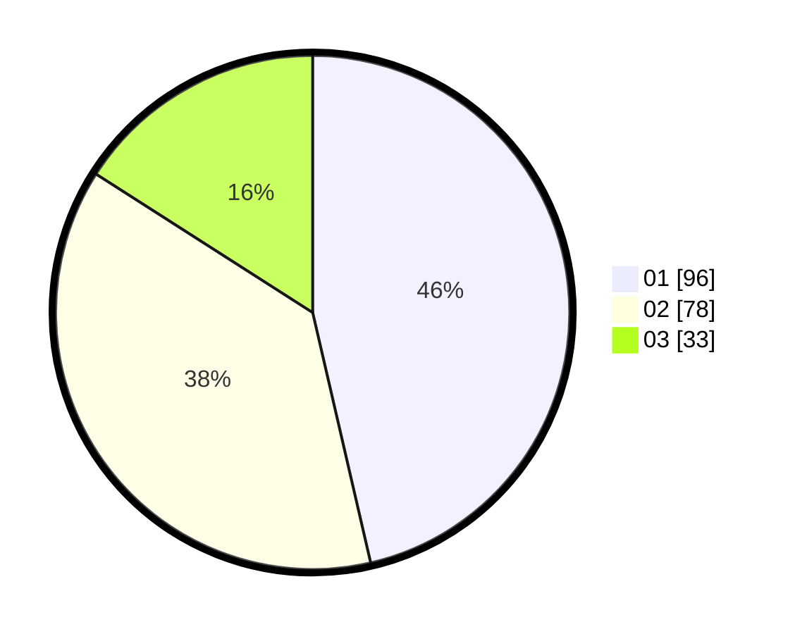

# Hasil

Hasil perolehan suara paslon dapat dilihat pada file paslon-01.txt, paslon-02.txt, dan paslon-03.txt.

Jika tidak ada, artinya data tersebut belum ada pada SIREKAP.

## Perolehan Suara

 * Paslon 01: **96**.
 * Paslon 02: **78**.
 * Paslon 03: **33**.

## Foto C Plano

https://sirekap-obj-formc.kpu.go.id/c9b3/pemilu/ppwp/31/71/03/10/07/3171031007015-20240216-152429--06c203df-5c1e-4e96-b3b9-4234679f1688.jpg

https://sirekap-obj-formc.kpu.go.id/c9b3/pemilu/ppwp/31/71/03/10/07/3171031007015-20240216-152430--6131d84f-99d8-433a-937c-f16b92224dca.jpg

https://sirekap-obj-formc.kpu.go.id/c9b3/pemilu/ppwp/31/71/03/10/07/3171031007015-20240216-152430--4e2db836-74b4-4afb-9088-769e1f88375c.jpg

## DATA PEMILIH TETAP

Jumlah pemilih dalam DPT: **211**.
 * L: **93**.
 * P: **118**.

## DATA PENGGUNA HAK PILIH

Jumlah pengguna hak pilih dalam DPT: **211**.
 * L: **93**.
 * P: **118**.

Jumlah pengguna hak pilih dalam DPTb: **1**.
 * L: **0**.
 * P: **1**.

Jumlah pengguna hak pilih dalam DPK: **0**.
 * L: **0**.
 * P: **0**.

Jumlah pengguna hak pilih: **212**.
 * L: **93**.
 * P: **119**.

## JUMLAH SUARA SAH DAN TIDAK SAH

JUMLAH SELURUH SUARA SAH: **207**.

JUMLAH SUARA TIDAK SAH: **5**.

JUMLAH SELURUH SUARA SAH DAN SUARA TIDAK SAH: **212**.
