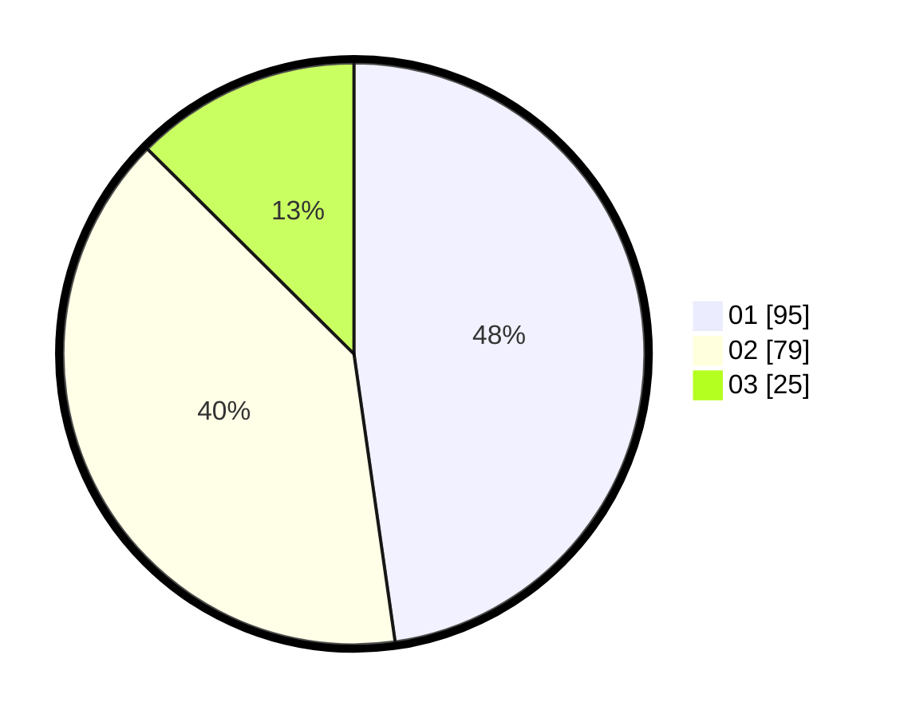

# Hasil

Hasil perolehan suara paslon dapat dilihat pada file paslon-01.txt, paslon-02.txt, dan paslon-03.txt.

Jika tidak ada, artinya data tersebut belum ada pada SIREKAP.

## Perolehan Suara

 * Paslon 01: **95**.
 * Paslon 02: **79**.
 * Paslon 03: **25**.

## Foto C Plano

https://sirekap-obj-formc.kpu.go.id/c35f/pemilu/ppwp/31/71/03/10/07/3171031007016-20240216-132908--3f15c9ca-03e4-4f01-b623-137e4a076b29.jpg

https://sirekap-obj-formc.kpu.go.id/c35f/pemilu/ppwp/31/71/03/10/07/3171031007016-20240216-132909--14f3cbf3-eb64-4ea0-bd21-35ca8133c20c.jpg

https://sirekap-obj-formc.kpu.go.id/c35f/pemilu/ppwp/31/71/03/10/07/3171031007016-20240216-132908--1c2c7b9c-d7ba-462c-81f8-3e5ca7b9d044.jpg

## DATA PEMILIH TETAP

Jumlah pemilih dalam DPT: **262**.
 * L: **128**.
 * P: **134**.

## DATA PENGGUNA HAK PILIH

Jumlah pengguna hak pilih dalam DPT: **197**.
 * L: **97**.
 * P: **100**.

Jumlah pengguna hak pilih dalam DPTb: **3**.
 * L: **1**.
 * P: **2**.

Jumlah pengguna hak pilih dalam DPK: **2**.
 * L: **1**.
 * P: **1**.

Jumlah pengguna hak pilih: **202**.
 * L: **99**.
 * P: **103**.

## JUMLAH SUARA SAH DAN TIDAK SAH

JUMLAH SELURUH SUARA SAH: **199**.

JUMLAH SUARA TIDAK SAH: **3**.

JUMLAH SELURUH SUARA SAH DAN SUARA TIDAK SAH: **202**.
