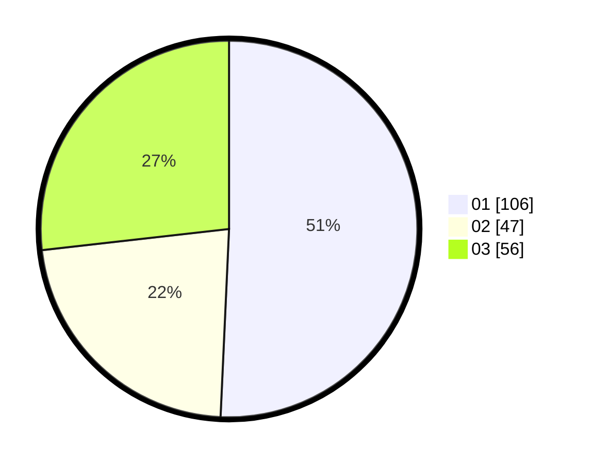

# Hasil

Hasil perolehan suara paslon dapat dilihat pada file paslon-01.txt, paslon-02.txt, dan paslon-03.txt.

Jika tidak ada, artinya data tersebut belum ada pada SIREKAP.

## Perolehan Suara

 * Paslon 01: **106**.
 * Paslon 02: **47**.
 * Paslon 03: **56**.

## Foto C Plano

https://sirekap-obj-formc.kpu.go.id/cc88/pemilu/ppwp/31/71/03/10/07/3171031007018-20240216-234233--8771c5c3-21ac-49ae-8815-71bac5cad07b.jpg

https://sirekap-obj-formc.kpu.go.id/cc88/pemilu/ppwp/31/71/03/10/07/3171031007018-20240216-234234--cc772b3f-e0da-4f58-bfe7-a24af19cf05a.jpg

https://sirekap-obj-formc.kpu.go.id/cc88/pemilu/ppwp/31/71/03/10/07/3171031007018-20240216-234233--ed6dd424-5045-4fcb-a3ee-86a3abd258a7.jpg

## DATA PEMILIH TETAP

Jumlah pemilih dalam DPT: **253**.
 * L: **119**.
 * P: **134**.

## DATA PENGGUNA HAK PILIH

Jumlah pengguna hak pilih dalam DPT: **203**.
 * L: **95**.
 * P: **108**.

Jumlah pengguna hak pilih dalam DPTb: **5**.
 * L: **2**.
 * P: **3**.

Jumlah pengguna hak pilih dalam DPK: **2**.
 * L: **0**.
 * P: **2**.

Jumlah pengguna hak pilih: **210**.
 * L: **97**.
 * P: **113**.

## JUMLAH SUARA SAH DAN TIDAK SAH

JUMLAH SELURUH SUARA SAH: **209**.

JUMLAH SUARA TIDAK SAH: **1**.

JUMLAH SELURUH SUARA SAH DAN SUARA TIDAK SAH: **210**.
