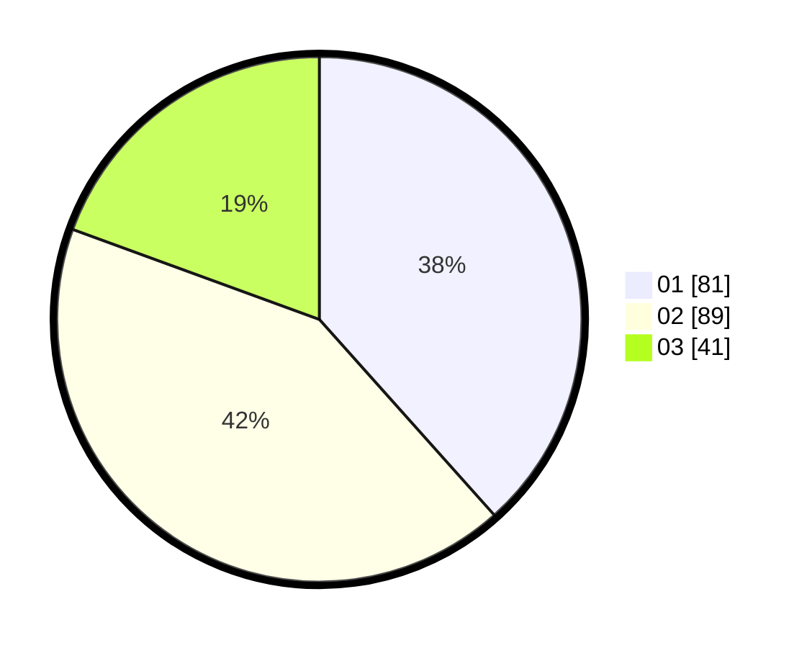

# Hasil

Hasil perolehan suara paslon dapat dilihat pada file paslon-01.txt, paslon-02.txt, dan paslon-03.txt.

Jika tidak ada, artinya data tersebut belum ada pada SIREKAP.

## Perolehan Suara

 * Paslon 01: **81**.
 * Paslon 02: **89**.
 * Paslon 03: **41**.

## Foto C Plano

https://sirekap-obj-formc.kpu.go.id/7304/pemilu/ppwp/31/71/03/10/07/3171031007019-20240216-024320--f7765ab1-3119-4c1b-b9b3-76beb079c9a9.jpg

https://sirekap-obj-formc.kpu.go.id/7304/pemilu/ppwp/31/71/03/10/07/3171031007019-20240216-024322--f898488c-8932-4e12-b3d3-f1442f7c47ff.jpg

https://sirekap-obj-formc.kpu.go.id/7304/pemilu/ppwp/31/71/03/10/07/3171031007019-20240216-024321--07c705e0-8576-4114-ab98-5a15e5d6ace3.jpg

## DATA PEMILIH TETAP

Jumlah pemilih dalam DPT: **271**.
 * L: **137**.
 * P: **134**.

## DATA PENGGUNA HAK PILIH

Jumlah pengguna hak pilih dalam DPT: **189**.
 * L: **84**.
 * P: **105**.

Jumlah pengguna hak pilih dalam DPTb: **22**.
 * L: **15**.
 * P: **7**.

Jumlah pengguna hak pilih dalam DPK: **0**.
 * L: **0**.
 * P: **0**.

Jumlah pengguna hak pilih: **211**.
 * L: **99**.
 * P: **112**.

## JUMLAH SUARA SAH DAN TIDAK SAH

JUMLAH SELURUH SUARA SAH: **211**.

JUMLAH SUARA TIDAK SAH: **0**.

JUMLAH SELURUH SUARA SAH DAN SUARA TIDAK SAH: **211**.
