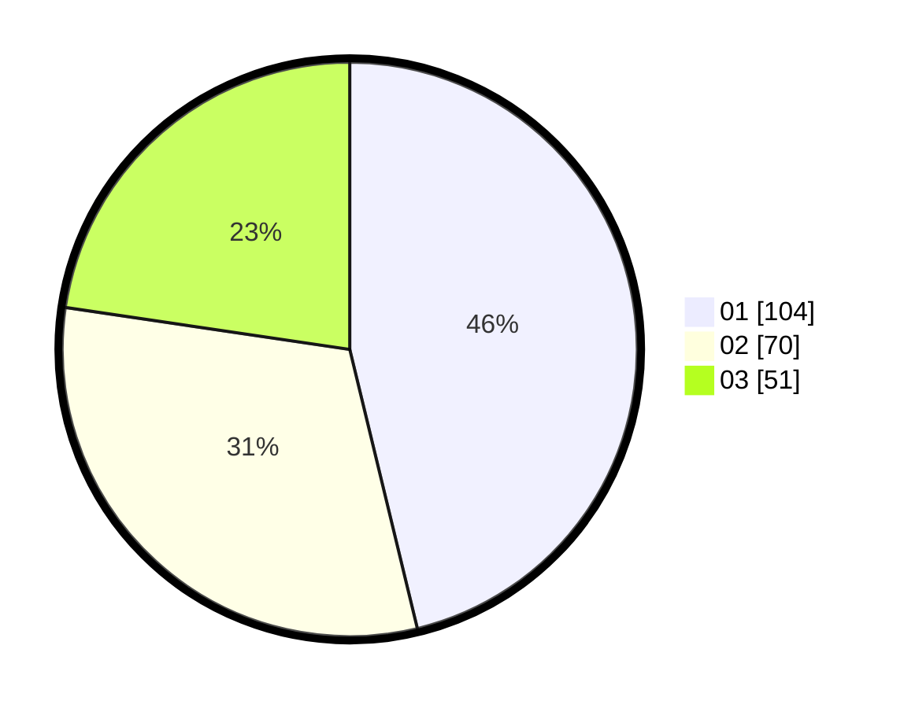

# Hasil

Hasil perolehan suara paslon dapat dilihat pada file paslon-01.txt, paslon-02.txt, dan paslon-03.txt.

Jika tidak ada, artinya data tersebut belum ada pada SIREKAP.

## Perolehan Suara

 * Paslon 01: **104**.
 * Paslon 02: **70**.
 * Paslon 03: **51**.

## Foto C Plano

https://sirekap-obj-formc.kpu.go.id/3df2/pemilu/ppwp/31/71/03/10/07/3171031007020-20240216-134603--25729e30-303f-4b62-9634-bfa7aa7c651f.jpg

https://sirekap-obj-formc.kpu.go.id/3df2/pemilu/ppwp/31/71/03/10/07/3171031007020-20240216-134604--d0a04e5d-20c7-4a91-92ab-1b3a5a5792d8.jpg

https://sirekap-obj-formc.kpu.go.id/3df2/pemilu/ppwp/31/71/03/10/07/3171031007020-20240216-134604--1e89a6df-e0a9-4ad6-a86e-6efc6445d135.jpg

## DATA PEMILIH TETAP

Jumlah pemilih dalam DPT: **272**.
 * L: **133**.
 * P: **139**.

## DATA PENGGUNA HAK PILIH

Jumlah pengguna hak pilih dalam DPT: **219**.
 * L: **104**.
 * P: **115**.

Jumlah pengguna hak pilih dalam DPTb: **6**.
 * L: **2**.
 * P: **4**.

Jumlah pengguna hak pilih dalam DPK: **1**.
 * L: **0**.
 * P: **1**.

Jumlah pengguna hak pilih: **226**.
 * L: **106**.
 * P: **120**.

## JUMLAH SUARA SAH DAN TIDAK SAH

JUMLAH SELURUH SUARA SAH: **225**.

JUMLAH SUARA TIDAK SAH: **1**.

JUMLAH SELURUH SUARA SAH DAN SUARA TIDAK SAH: **226**.
