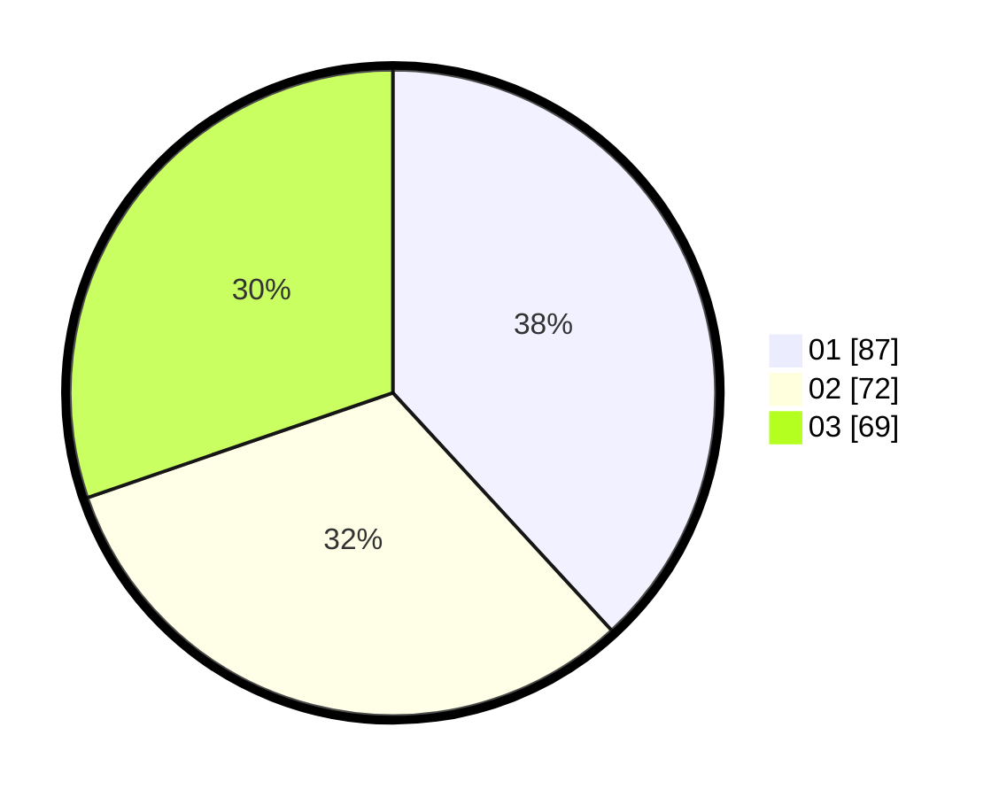

# Hasil

Hasil perolehan suara paslon dapat dilihat pada file paslon-01.txt, paslon-02.txt, dan paslon-03.txt.

Jika tidak ada, artinya data tersebut belum ada pada SIREKAP.

## Perolehan Suara

 * Paslon 01: **87**.
 * Paslon 02: **72**.
 * Paslon 03: **69**.

## Foto C Plano

https://sirekap-obj-formc.kpu.go.id/0e7a/pemilu/ppwp/31/71/03/10/07/3171031007024-20240216-220954--3b5da576-384c-4494-9b0c-936e73c291b9.jpg

https://sirekap-obj-formc.kpu.go.id/0e7a/pemilu/ppwp/31/71/03/10/07/3171031007024-20240216-220955--0638ee3c-6615-464a-89a8-a399db81b15a.jpg

https://sirekap-obj-formc.kpu.go.id/0e7a/pemilu/ppwp/31/71/03/10/07/3171031007024-20240216-220954--b1bffa8c-2a9b-4adc-b482-9a236cbf8213.jpg

## DATA PEMILIH TETAP

Jumlah pemilih dalam DPT: **269**.
 * L: **136**.
 * P: **133**.

## DATA PENGGUNA HAK PILIH

Jumlah pengguna hak pilih dalam DPT: **217**.
 * L: **109**.
 * P: **108**.

Jumlah pengguna hak pilih dalam DPTb: **11**.
 * L: **3**.
 * P: **8**.

Jumlah pengguna hak pilih dalam DPK: **3**.
 * L: **1**.
 * P: **2**.

Jumlah pengguna hak pilih: **231**.
 * L: **113**.
 * P: **118**.

## JUMLAH SUARA SAH DAN TIDAK SAH

JUMLAH SELURUH SUARA SAH: **228**.

JUMLAH SUARA TIDAK SAH: **3**.

JUMLAH SELURUH SUARA SAH DAN SUARA TIDAK SAH: **231**.
