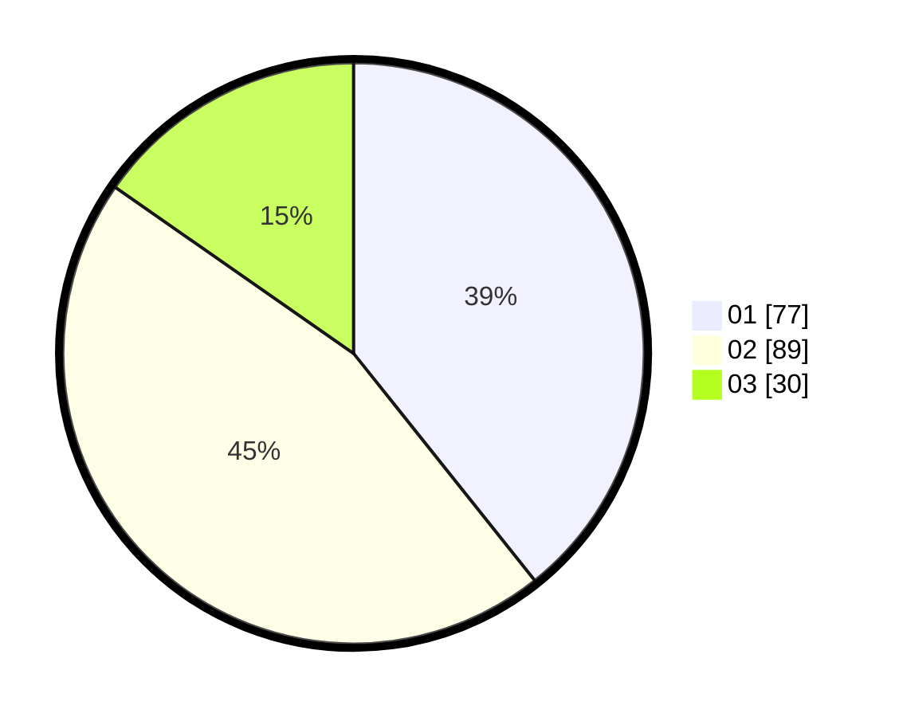

# Hasil

Hasil perolehan suara paslon dapat dilihat pada file paslon-01.txt, paslon-02.txt, dan paslon-03.txt.

Jika tidak ada, artinya data tersebut belum ada pada SIREKAP.

## Perolehan Suara

 * Paslon 01: **77**.
 * Paslon 02: **89**.
 * Paslon 03: **30**.

## Foto C Plano

https://sirekap-obj-formc.kpu.go.id/5f40/pemilu/ppwp/31/71/03/10/07/3171031007027-20240214-184517--036c9332-0c57-4560-8c48-809687534d66.jpg

https://sirekap-obj-formc.kpu.go.id/5f40/pemilu/ppwp/31/71/03/10/07/3171031007027-20240214-195809--19388381-f4e0-4098-b710-bf56c0f8a62d.jpg

https://sirekap-obj-formc.kpu.go.id/5f40/pemilu/ppwp/31/71/03/10/07/3171031007027-20240214-193007--16fe0479-1090-4ed5-8aed-8b55be3737a0.jpg

## DATA PEMILIH TETAP

Jumlah pemilih dalam DPT: **287**.
 * L: **143**.
 * P: **144**.

## DATA PENGGUNA HAK PILIH

Jumlah pengguna hak pilih dalam DPT: **201**.
 * L: **93**.
 * P: **108**.

Jumlah pengguna hak pilih dalam DPTb: **1**.
 * L: **0**.
 * P: **1**.

Jumlah pengguna hak pilih dalam DPK: **1**.
 * L: **1**.
 * P: **0**.

Jumlah pengguna hak pilih: **203**.
 * L: **94**.
 * P: **109**.

## JUMLAH SUARA SAH DAN TIDAK SAH

JUMLAH SELURUH SUARA SAH: **196**.

JUMLAH SUARA TIDAK SAH: **7**.

JUMLAH SELURUH SUARA SAH DAN SUARA TIDAK SAH: **203**.
