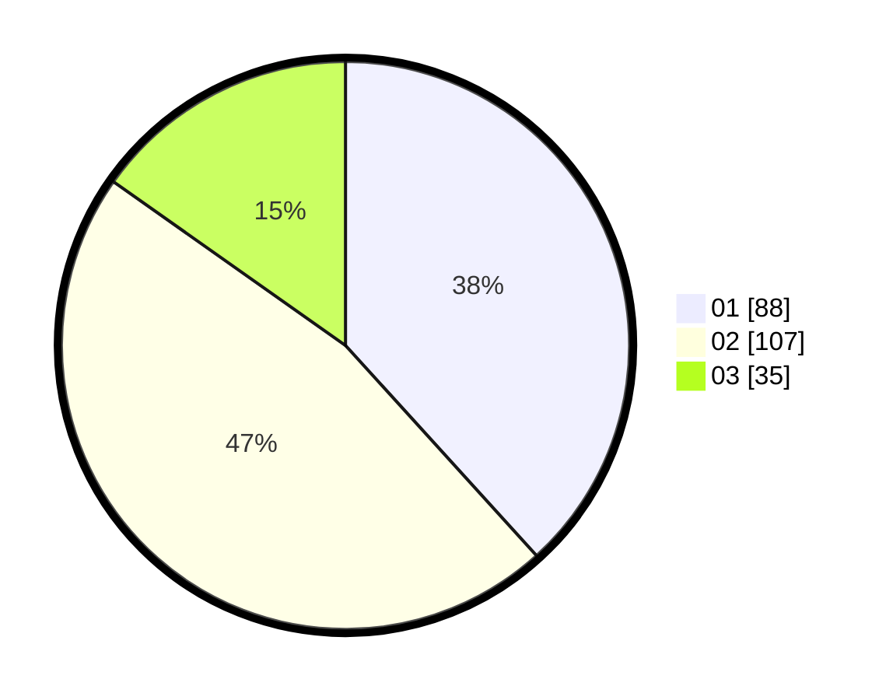

# Hasil

Hasil perolehan suara paslon dapat dilihat pada file paslon-01.txt, paslon-02.txt, dan paslon-03.txt.

Jika tidak ada, artinya data tersebut belum ada pada SIREKAP.

## Perolehan Suara

 * Paslon 01: **88**.
 * Paslon 02: **107**.
 * Paslon 03: **35**.

## Foto C Plano

https://sirekap-obj-formc.kpu.go.id/058b/pemilu/ppwp/31/71/03/10/07/3171031007028-20240216-092818--c3b880a0-650e-4c5f-a9d2-44940ae8a48e.jpg

https://sirekap-obj-formc.kpu.go.id/058b/pemilu/ppwp/31/71/03/10/07/3171031007028-20240216-092822--645c468a-8ee1-485f-bef7-a80d19996858.jpg

https://sirekap-obj-formc.kpu.go.id/058b/pemilu/ppwp/31/71/03/10/07/3171031007028-20240216-092821--f53fbf05-d4e0-4755-bbc9-93bdbb7b35c3.jpg

## DATA PEMILIH TETAP

Jumlah pemilih dalam DPT: **0**.
 * L: **0**.
 * P: **0**.

## DATA PENGGUNA HAK PILIH

Jumlah pengguna hak pilih dalam DPT: **221**.
 * L: **111**.
 * P: **110**.

Jumlah pengguna hak pilih dalam DPTb: **2**.
 * L: **0**.
 * P: **2**.

Jumlah pengguna hak pilih dalam DPK: **9**.
 * L: **4**.
 * P: **5**.

Jumlah pengguna hak pilih: **232**.
 * L: **115**.
 * P: **117**.

## JUMLAH SUARA SAH DAN TIDAK SAH

JUMLAH SELURUH SUARA SAH: **230**.

JUMLAH SUARA TIDAK SAH: **2**.

JUMLAH SELURUH SUARA SAH DAN SUARA TIDAK SAH: **232**.
