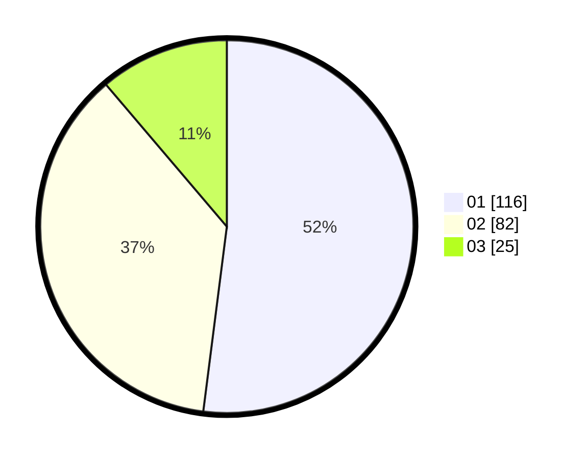

# Hasil

Hasil perolehan suara paslon dapat dilihat pada file paslon-01.txt, paslon-02.txt, dan paslon-03.txt.

Jika tidak ada, artinya data tersebut belum ada pada SIREKAP.

## Perolehan Suara

 * Paslon 01: **116**.
 * Paslon 02: **82**.
 * Paslon 03: **25**.

## Foto C Plano

https://sirekap-obj-formc.kpu.go.id/bd43/pemilu/ppwp/31/71/03/10/07/3171031007035-20240215-001954--a559c67c-dd2d-4f5a-912c-fd37181ee4de.jpg

https://sirekap-obj-formc.kpu.go.id/bd43/pemilu/ppwp/31/71/03/10/07/3171031007035-20240215-002126--0ebf9133-e9ac-4b5e-848d-52e053d3ddee.jpg
