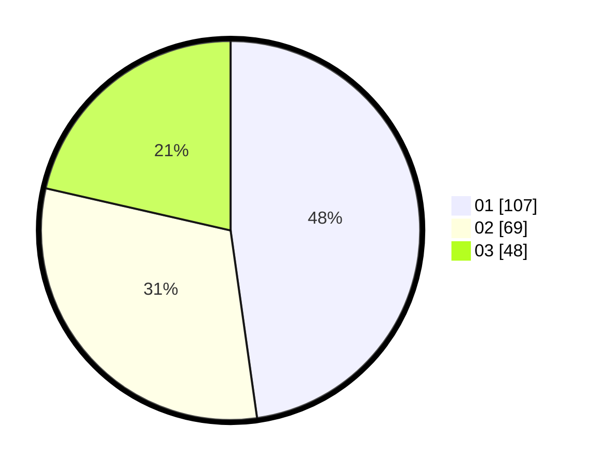

# Hasil

Hasil perolehan suara paslon dapat dilihat pada file paslon-01.txt, paslon-02.txt, dan paslon-03.txt.

Jika tidak ada, artinya data tersebut belum ada pada SIREKAP.

## Perolehan Suara

 * Paslon 01: **107**.
 * Paslon 02: **69**.
 * Paslon 03: **48**.

## Foto C Plano

https://sirekap-obj-formc.kpu.go.id/a9b2/pemilu/ppwp/31/71/03/10/07/3171031007037-20240214-232014--671344b8-f258-4523-9ed8-60c408a0cd40.jpg

https://sirekap-obj-formc.kpu.go.id/a9b2/pemilu/ppwp/31/71/03/10/07/3171031007037-20240214-232036--66e6ca62-9fe3-47d0-9f21-46967f0a67d7.jpg

https://sirekap-obj-formc.kpu.go.id/a9b2/pemilu/ppwp/31/71/03/10/07/3171031007037-20240214-232140--0b9d1b08-d7c2-411c-87a5-c0d5ec318793.jpg
