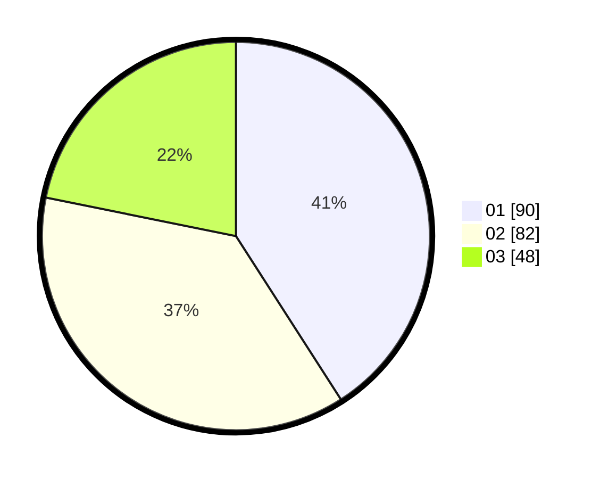

# Hasil

Hasil perolehan suara paslon dapat dilihat pada file paslon-01.txt, paslon-02.txt, dan paslon-03.txt.

Jika tidak ada, artinya data tersebut belum ada pada SIREKAP.

## Perolehan Suara

 * Paslon 01: **90**.
 * Paslon 02: **82**.
 * Paslon 03: **48**.

## Foto C Plano

https://sirekap-obj-formc.kpu.go.id/b27b/pemilu/ppwp/31/71/03/10/07/3171031007038-20240214-190951--d5ce5ff7-4d57-4e92-a586-cfc16ab6ca07.jpg

https://sirekap-obj-formc.kpu.go.id/b27b/pemilu/ppwp/31/71/03/10/07/3171031007038-20240214-191002--e691f72f-d60f-4258-8a14-233bc4640861.jpg

https://sirekap-obj-formc.kpu.go.id/b27b/pemilu/ppwp/31/71/03/10/07/3171031007038-20240214-191010--a7c38032-1d03-4aa8-a63d-b2899ed47dc5.jpg

## DATA PEMILIH TETAP

Jumlah pemilih dalam DPT: **275**.
 * L: **123**.
 * P: **152**.

## DATA PENGGUNA HAK PILIH

Jumlah pengguna hak pilih dalam DPT: **204**.
 * L: **88**.
 * P: **116**.

Jumlah pengguna hak pilih dalam DPTb: **16**.
 * L: **11**.
 * P: **5**.

Jumlah pengguna hak pilih dalam DPK: **4**.
 * L: **1**.
 * P: **3**.

Jumlah pengguna hak pilih: **224**.
 * L: **100**.
 * P: **124**.

## JUMLAH SUARA SAH DAN TIDAK SAH

JUMLAH SELURUH SUARA SAH: **220**.

JUMLAH SUARA TIDAK SAH: **4**.

JUMLAH SELURUH SUARA SAH DAN SUARA TIDAK SAH: **224**.
