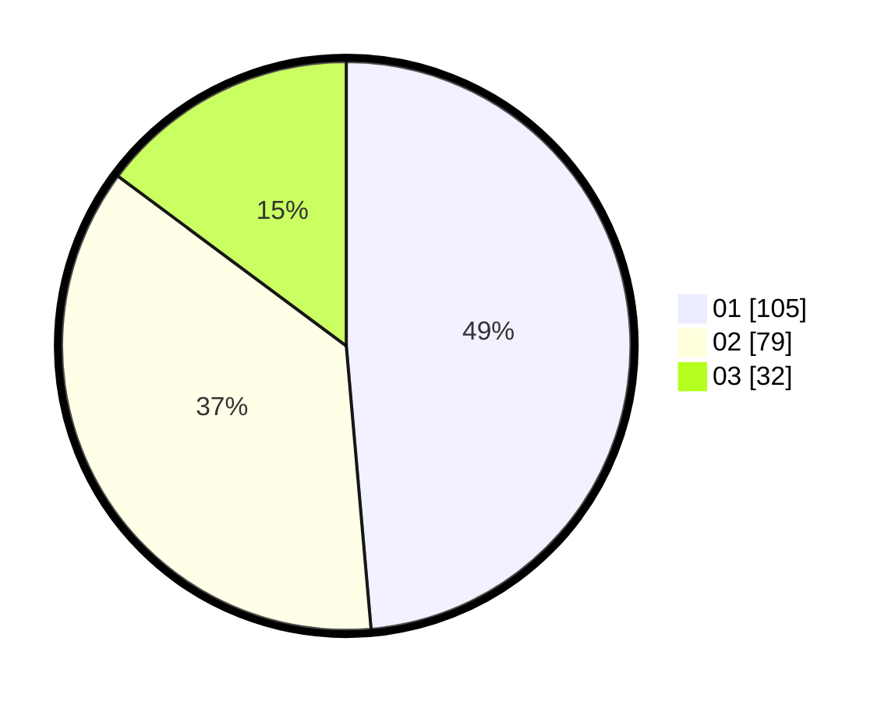

# Hasil

Hasil perolehan suara paslon dapat dilihat pada file paslon-01.txt, paslon-02.txt, dan paslon-03.txt.

Jika tidak ada, artinya data tersebut belum ada pada SIREKAP.

## Perolehan Suara

 * Paslon 01: **105**.
 * Paslon 02: **79**.
 * Paslon 03: **32**.

## Foto C Plano

https://sirekap-obj-formc.kpu.go.id/d450/pemilu/ppwp/31/71/03/10/07/3171031007039-20240216-015211--513bb2e6-9c12-45ed-b346-f75c3d6200e0.jpg

https://sirekap-obj-formc.kpu.go.id/d450/pemilu/ppwp/31/71/03/10/07/3171031007039-20240216-015225--08177f22-8882-415c-b166-b3119c2e8036.jpg

https://sirekap-obj-formc.kpu.go.id/d450/pemilu/ppwp/31/71/03/10/07/3171031007039-20240216-015219--e53a7559-238e-4bb3-ba5d-05d8d1f659aa.jpg

## DATA PEMILIH TETAP

Jumlah pemilih dalam DPT: **280**.
 * L: **140**.
 * P: **140**.

## DATA PENGGUNA HAK PILIH

Jumlah pengguna hak pilih dalam DPT: **211**.
 * L: **102**.
 * P: **109**.

Jumlah pengguna hak pilih dalam DPTb: **5**.
 * L: **2**.
 * P: **3**.

Jumlah pengguna hak pilih dalam DPK: **3**.
 * L: **2**.
 * P: **1**.

Jumlah pengguna hak pilih: **219**.
 * L: **106**.
 * P: **113**.

## JUMLAH SUARA SAH DAN TIDAK SAH

JUMLAH SELURUH SUARA SAH: **216**.

JUMLAH SUARA TIDAK SAH: **3**.

JUMLAH SELURUH SUARA SAH DAN SUARA TIDAK SAH: **219**.
