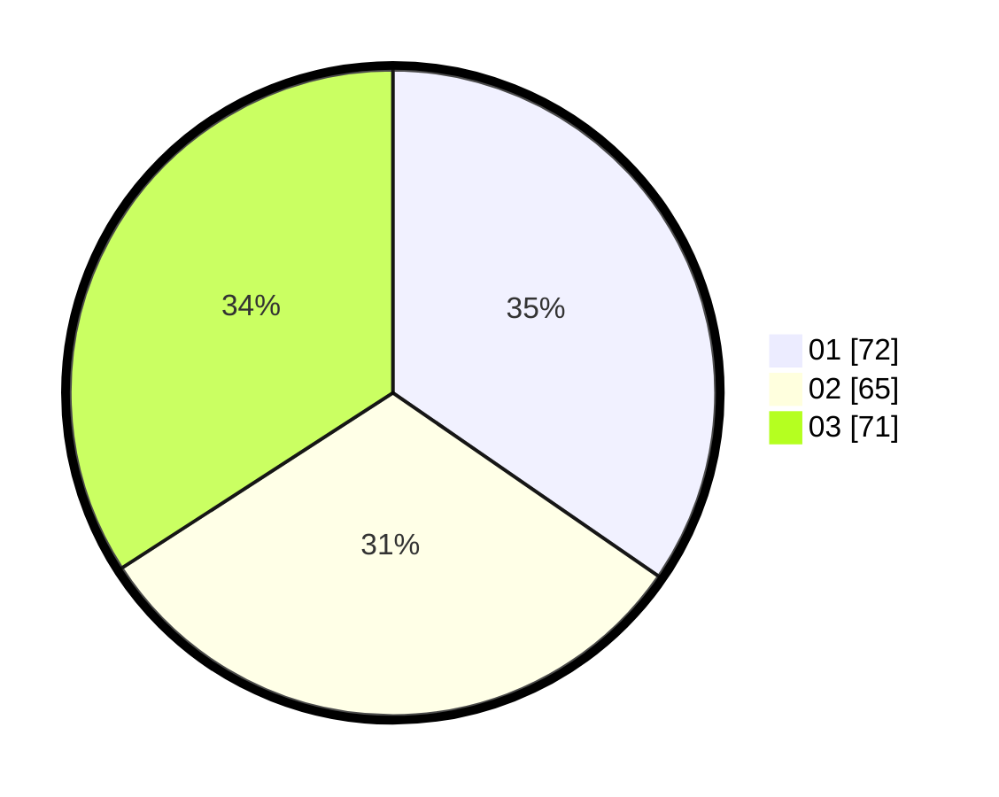

# Hasil

Hasil perolehan suara paslon dapat dilihat pada file paslon-01.txt, paslon-02.txt, dan paslon-03.txt.

Jika tidak ada, artinya data tersebut belum ada pada SIREKAP.

## Perolehan Suara

 * Paslon 01: **72**.
 * Paslon 02: **65**.
 * Paslon 03: **71**.

## Foto C Plano

https://sirekap-obj-formc.kpu.go.id/83e8/pemilu/ppwp/31/71/03/10/07/3171031007043-20240216-131715--2bbaea5f-e616-4bd1-8be1-45a8d2a12f40.jpg

https://sirekap-obj-formc.kpu.go.id/83e8/pemilu/ppwp/31/71/03/10/07/3171031007043-20240214-191820--7c45d8fe-e045-48bd-8be8-b0d260260984.jpg

https://sirekap-obj-formc.kpu.go.id/83e8/pemilu/ppwp/31/71/03/10/07/3171031007043-20240214-191427--d4c3ff70-5fb9-49fc-83e7-5213da125da8.jpg

## DATA PEMILIH TETAP

Jumlah pemilih dalam DPT: **268**.
 * L: **132**.
 * P: **136**.

## DATA PENGGUNA HAK PILIH

Jumlah pengguna hak pilih dalam DPT: **206**.
 * L: **98**.
 * P: **108**.

Jumlah pengguna hak pilih dalam DPTb: **2**.
 * L: **1**.
 * P: **1**.

Jumlah pengguna hak pilih dalam DPK: **3**.
 * L: **2**.
 * P: **1**.

Jumlah pengguna hak pilih: **211**.
 * L: **101**.
 * P: **110**.

## JUMLAH SUARA SAH DAN TIDAK SAH

JUMLAH SELURUH SUARA SAH: **208**.

JUMLAH SUARA TIDAK SAH: **3**.

JUMLAH SELURUH SUARA SAH DAN SUARA TIDAK SAH: **211**.
