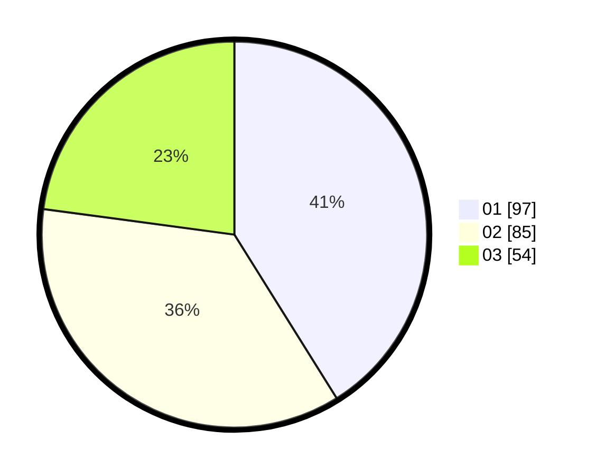

# Hasil

Hasil perolehan suara paslon dapat dilihat pada file paslon-01.txt, paslon-02.txt, dan paslon-03.txt.

Jika tidak ada, artinya data tersebut belum ada pada SIREKAP.

## Perolehan Suara

 * Paslon 01: **97**.
 * Paslon 02: **85**.
 * Paslon 03: **54**.

## Foto C Plano

https://sirekap-obj-formc.kpu.go.id/1c08/pemilu/ppwp/31/71/03/10/07/3171031007044-20240217-011306--fe28e0fb-3bff-4f12-8bec-35d64f1854b1.jpg

https://sirekap-obj-formc.kpu.go.id/1c08/pemilu/ppwp/31/71/03/10/07/3171031007044-20240217-011407--bff77c32-959c-42a0-8ed3-796ac25c90cc.jpg

https://sirekap-obj-formc.kpu.go.id/1c08/pemilu/ppwp/31/71/03/10/07/3171031007044-20240217-012043--8e251954-3c8f-4026-8a17-fcb655b81439.jpg

## DATA PEMILIH TETAP

Jumlah pemilih dalam DPT: **284**.
 * L: **135**.
 * P: **149**.

## DATA PENGGUNA HAK PILIH

Jumlah pengguna hak pilih dalam DPT: **230**.
 * L: **108**.
 * P: **122**.

Jumlah pengguna hak pilih dalam DPTb: **6**.
 * L: **3**.
 * P: **3**.

Jumlah pengguna hak pilih dalam DPK: **2**.
 * L: **1**.
 * P: **1**.

Jumlah pengguna hak pilih: **238**.
 * L: **112**.
 * P: **126**.

## JUMLAH SUARA SAH DAN TIDAK SAH

JUMLAH SELURUH SUARA SAH: **236**.

JUMLAH SUARA TIDAK SAH: **2**.

JUMLAH SELURUH SUARA SAH DAN SUARA TIDAK SAH: **238**.
