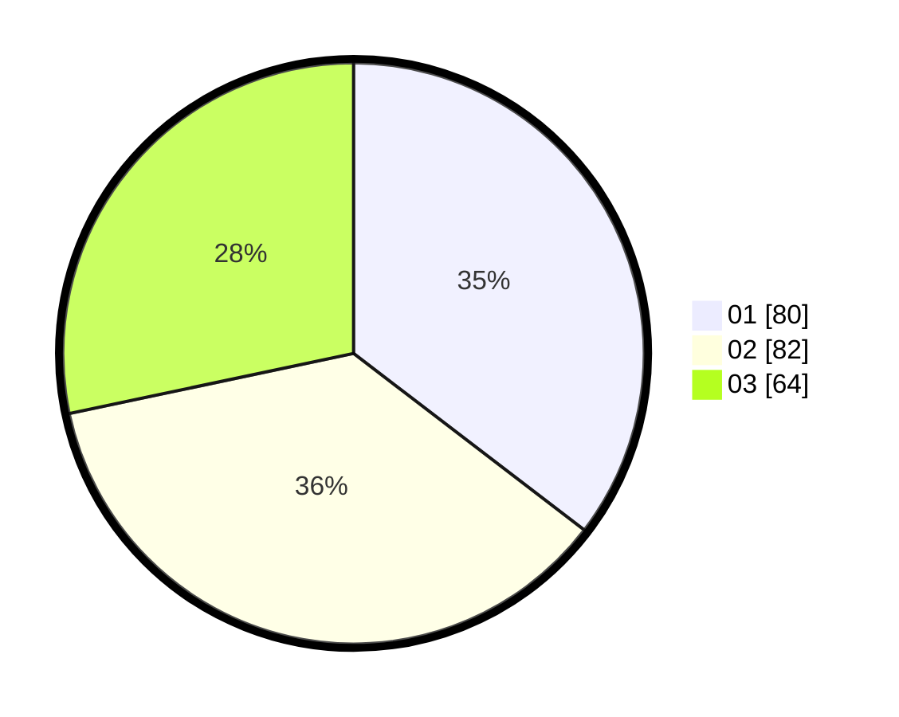

# Hasil

Hasil perolehan suara paslon dapat dilihat pada file paslon-01.txt, paslon-02.txt, dan paslon-03.txt.

Jika tidak ada, artinya data tersebut belum ada pada SIREKAP.

## Perolehan Suara

 * Paslon 01: **80**.
 * Paslon 02: **82**.
 * Paslon 03: **64**.

## Foto C Plano

https://sirekap-obj-formc.kpu.go.id/d744/pemilu/ppwp/31/71/03/10/07/3171031007047-20240216-233409--5d3466ca-966c-49be-b8b5-a98640f0d530.jpg

https://sirekap-obj-formc.kpu.go.id/d744/pemilu/ppwp/31/71/03/10/07/3171031007047-20240216-233410--844a25fc-6df6-44bd-beac-e189d3454e4d.jpg

https://sirekap-obj-formc.kpu.go.id/d744/pemilu/ppwp/31/71/03/10/07/3171031007047-20240216-233410--dfc9d018-6c93-4fdf-a01d-36d3725ac9ac.jpg

## DATA PEMILIH TETAP

Jumlah pemilih dalam DPT: **280**.
 * L: **133**.
 * P: **147**.

## DATA PENGGUNA HAK PILIH

Jumlah pengguna hak pilih dalam DPT: **221**.
 * L: **105**.
 * P: **116**.

Jumlah pengguna hak pilih dalam DPTb: **6**.
 * L: **6**.
 * P: **0**.

Jumlah pengguna hak pilih dalam DPK: **1**.
 * L: **1**.
 * P: **0**.

Jumlah pengguna hak pilih: **228**.
 * L: **112**.
 * P: **116**.

## JUMLAH SUARA SAH DAN TIDAK SAH

JUMLAH SELURUH SUARA SAH: **226**.

JUMLAH SUARA TIDAK SAH: **2**.

JUMLAH SELURUH SUARA SAH DAN SUARA TIDAK SAH: **228**.
