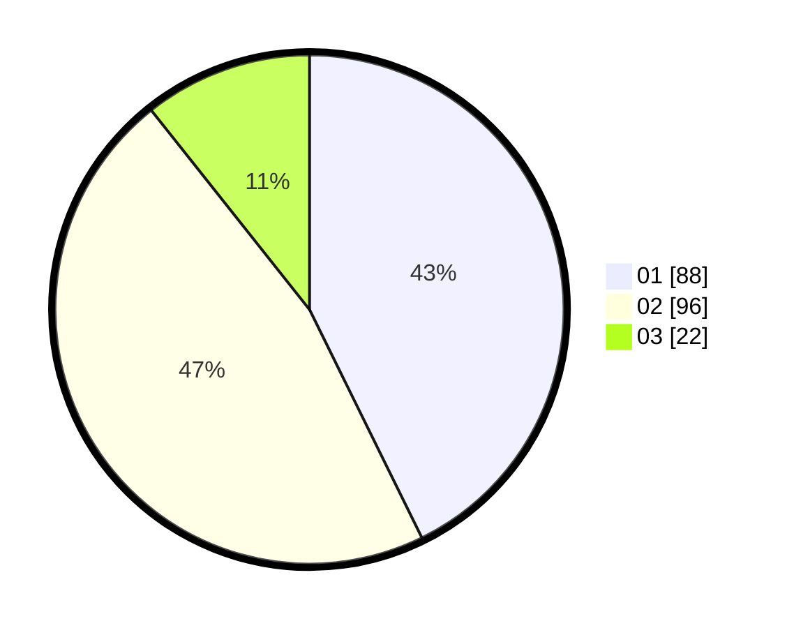

# Hasil

Hasil perolehan suara paslon dapat dilihat pada file paslon-01.txt, paslon-02.txt, dan paslon-03.txt.

Jika tidak ada, artinya data tersebut belum ada pada SIREKAP.

## Perolehan Suara

 * Paslon 01: **88**.
 * Paslon 02: **96**.
 * Paslon 03: **22**.

## Foto C Plano

https://sirekap-obj-formc.kpu.go.id/703f/pemilu/ppwp/31/71/03/10/07/3171031007049-20240216-145212--ca12250c-42f4-4dda-af4f-a908ff4c44a9.jpg

https://sirekap-obj-formc.kpu.go.id/703f/pemilu/ppwp/31/71/03/10/07/3171031007049-20240216-145214--e142f493-8087-4d43-969c-bb60ee0d1893.jpg

https://sirekap-obj-formc.kpu.go.id/703f/pemilu/ppwp/31/71/03/10/07/3171031007049-20240216-145213--ee4ed4be-9a86-49b0-9ff1-4bb37c25d722.jpg

## DATA PEMILIH TETAP

Jumlah pemilih dalam DPT: **255**.
 * L: **132**.
 * P: **123**.

## DATA PENGGUNA HAK PILIH

Jumlah pengguna hak pilih dalam DPT: **200**.
 * L: **102**.
 * P: **98**.

Jumlah pengguna hak pilih dalam DPTb: **10**.
 * L: **2**.
 * P: **8**.

Jumlah pengguna hak pilih dalam DPK: **1**.
 * L: **1**.
 * P: **0**.

Jumlah pengguna hak pilih: **211**.
 * L: **105**.
 * P: **106**.

## JUMLAH SUARA SAH DAN TIDAK SAH

JUMLAH SELURUH SUARA SAH: **206**.

JUMLAH SUARA TIDAK SAH: **5**.

JUMLAH SELURUH SUARA SAH DAN SUARA TIDAK SAH: **211**.
