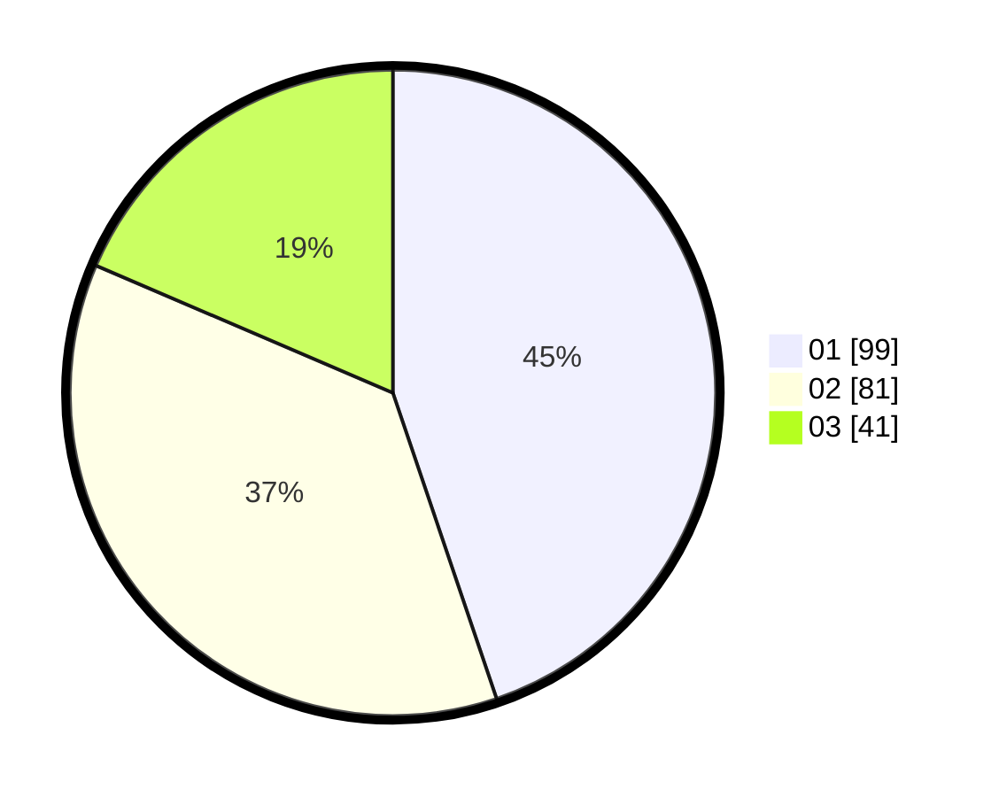

# Hasil

Hasil perolehan suara paslon dapat dilihat pada file paslon-01.txt, paslon-02.txt, dan paslon-03.txt.

Jika tidak ada, artinya data tersebut belum ada pada SIREKAP.

## Perolehan Suara

 * Paslon 01: **99**.
 * Paslon 02: **81**.
 * Paslon 03: **41**.

## Foto C Plano

https://sirekap-obj-formc.kpu.go.id/b82f/pemilu/ppwp/31/71/03/10/07/3171031007054-20240216-231058--e28669b8-f632-4c3c-aa27-95b3a48e2b52.jpg

https://sirekap-obj-formc.kpu.go.id/b82f/pemilu/ppwp/31/71/03/10/07/3171031007054-20240216-231059--0fd802c3-d53d-453d-9526-ec2fdb9e6204.jpg

https://sirekap-obj-formc.kpu.go.id/b82f/pemilu/ppwp/31/71/03/10/07/3171031007054-20240216-231059--1db22f87-0c70-4eb9-b8fb-35cc75ce68ea.jpg

## DATA PEMILIH TETAP

Jumlah pemilih dalam DPT: **274**.
 * L: **135**.
 * P: **139**.

## DATA PENGGUNA HAK PILIH

Jumlah pengguna hak pilih dalam DPT: **212**.
 * L: **100**.
 * P: **112**.

Jumlah pengguna hak pilih dalam DPTb: **5**.
 * L: **1**.
 * P: **4**.

Jumlah pengguna hak pilih dalam DPK: **6**.
 * L: **2**.
 * P: **4**.

Jumlah pengguna hak pilih: **223**.
 * L: **103**.
 * P: **120**.

## JUMLAH SUARA SAH DAN TIDAK SAH

JUMLAH SELURUH SUARA SAH: **221**.

JUMLAH SUARA TIDAK SAH: **2**.

JUMLAH SELURUH SUARA SAH DAN SUARA TIDAK SAH: **223**.
