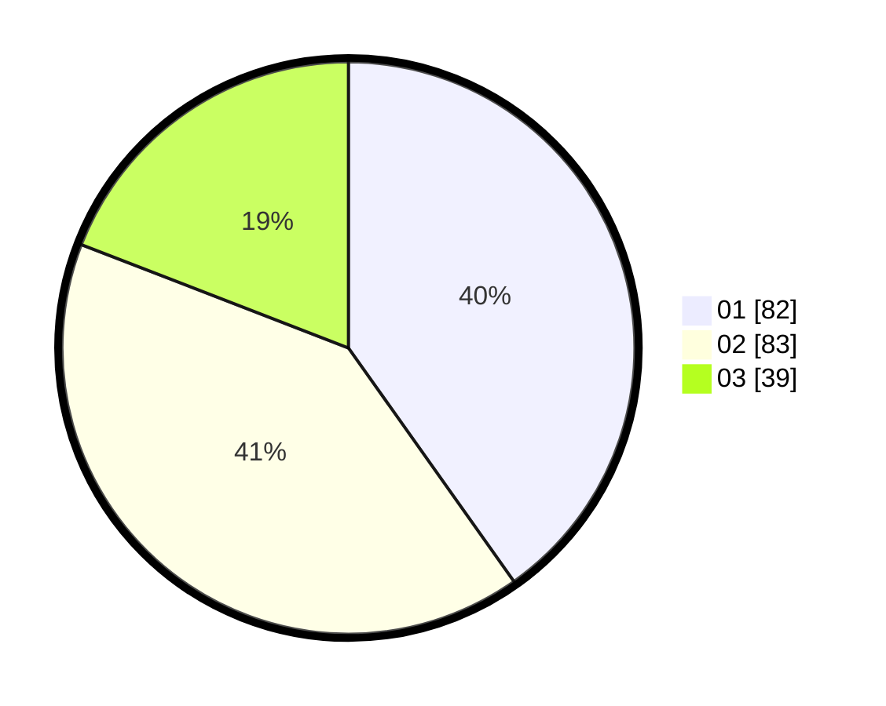

# Hasil

Hasil perolehan suara paslon dapat dilihat pada file paslon-01.txt, paslon-02.txt, dan paslon-03.txt.

Jika tidak ada, artinya data tersebut belum ada pada SIREKAP.

## Perolehan Suara

 * Paslon 01: **82**.
 * Paslon 02: **83**.
 * Paslon 03: **39**.

## Foto C Plano

https://sirekap-obj-formc.kpu.go.id/7c76/pemilu/ppwp/31/71/03/10/07/3171031007058-20240215-211550--1a241bb7-37d1-4e01-8a07-b38309e19e7f.jpg

https://sirekap-obj-formc.kpu.go.id/7c76/pemilu/ppwp/31/71/03/10/07/3171031007058-20240215-211552--4bad8601-609a-44cd-a68c-57f0433b832a.jpg

https://sirekap-obj-formc.kpu.go.id/7c76/pemilu/ppwp/31/71/03/10/07/3171031007058-20240215-211551--02808248-e307-43c1-93e8-f01eef6e3990.jpg

## DATA PEMILIH TETAP

Jumlah pemilih dalam DPT: **256**.
 * L: **126**.
 * P: **130**.

## DATA PENGGUNA HAK PILIH

Jumlah pengguna hak pilih dalam DPT: **197**.
 * L: **93**.
 * P: **104**.

Jumlah pengguna hak pilih dalam DPTb: **6**.
 * L: **4**.
 * P: **2**.

Jumlah pengguna hak pilih dalam DPK: **5**.
 * L: **3**.
 * P: **2**.

Jumlah pengguna hak pilih: **208**.
 * L: **100**.
 * P: **108**.

## JUMLAH SUARA SAH DAN TIDAK SAH

JUMLAH SELURUH SUARA SAH: **204**.

JUMLAH SUARA TIDAK SAH: **4**.

JUMLAH SELURUH SUARA SAH DAN SUARA TIDAK SAH: **208**.
