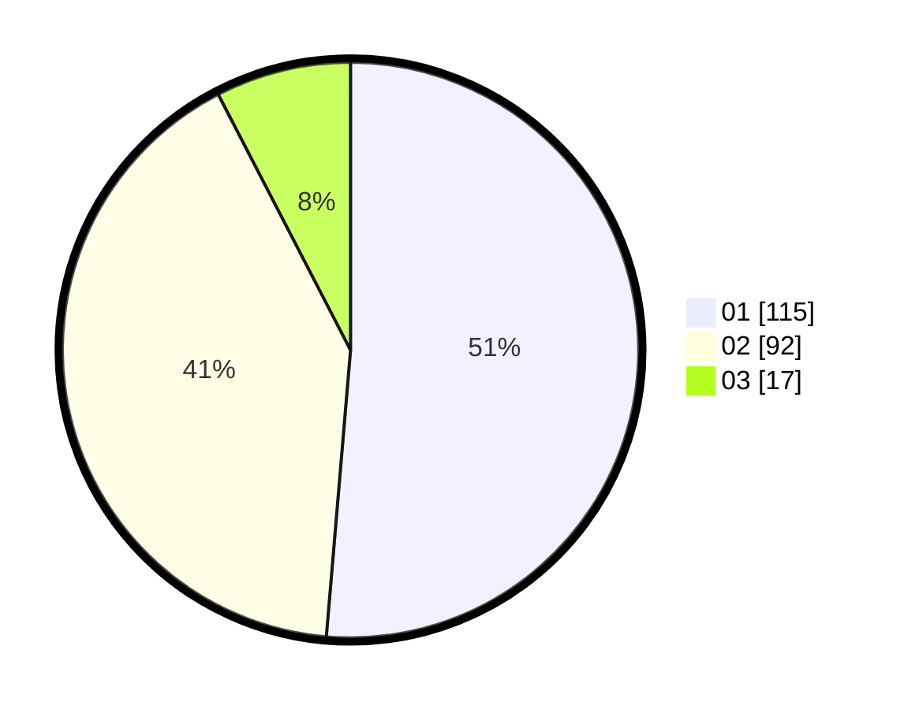

# Hasil

Hasil perolehan suara paslon dapat dilihat pada file paslon-01.txt, paslon-02.txt, dan paslon-03.txt.

Jika tidak ada, artinya data tersebut belum ada pada SIREKAP.

## Perolehan Suara

 * Paslon 01: **115**.
 * Paslon 02: **92**.
 * Paslon 03: **17**.

## Foto C Plano

https://sirekap-obj-formc.kpu.go.id/cc16/pemilu/ppwp/31/71/03/10/07/3171031007059-20240214-155314--ed89db08-fe9f-436d-8f62-c1120c31b730.jpg

https://sirekap-obj-formc.kpu.go.id/cc16/pemilu/ppwp/31/71/03/10/07/3171031007059-20240214-204212--a1571158-3277-429a-974e-357c7e5192d1.jpg

https://sirekap-obj-formc.kpu.go.id/cc16/pemilu/ppwp/31/71/03/10/07/3171031007059-20240214-214502--b93f39d5-cd65-49a4-b8d3-3c36e08b35e1.jpg

## DATA PEMILIH TETAP

Jumlah pemilih dalam DPT: **278**.
 * L: **137**.
 * P: **141**.

## DATA PENGGUNA HAK PILIH

Jumlah pengguna hak pilih dalam DPT: **214**.
 * L: **99**.
 * P: **116**.

Jumlah pengguna hak pilih dalam DPTb: **11**.
 * L: **6**.
 * P: **5**.

Jumlah pengguna hak pilih dalam DPK: **2**.
 * L: **1**.
 * P: **1**.

Jumlah pengguna hak pilih: **228**.
 * L: **106**.
 * P: **122**.

## JUMLAH SUARA SAH DAN TIDAK SAH

JUMLAH SELURUH SUARA SAH: **224**.

JUMLAH SUARA TIDAK SAH: **4**.

JUMLAH SELURUH SUARA SAH DAN SUARA TIDAK SAH: **228**.
