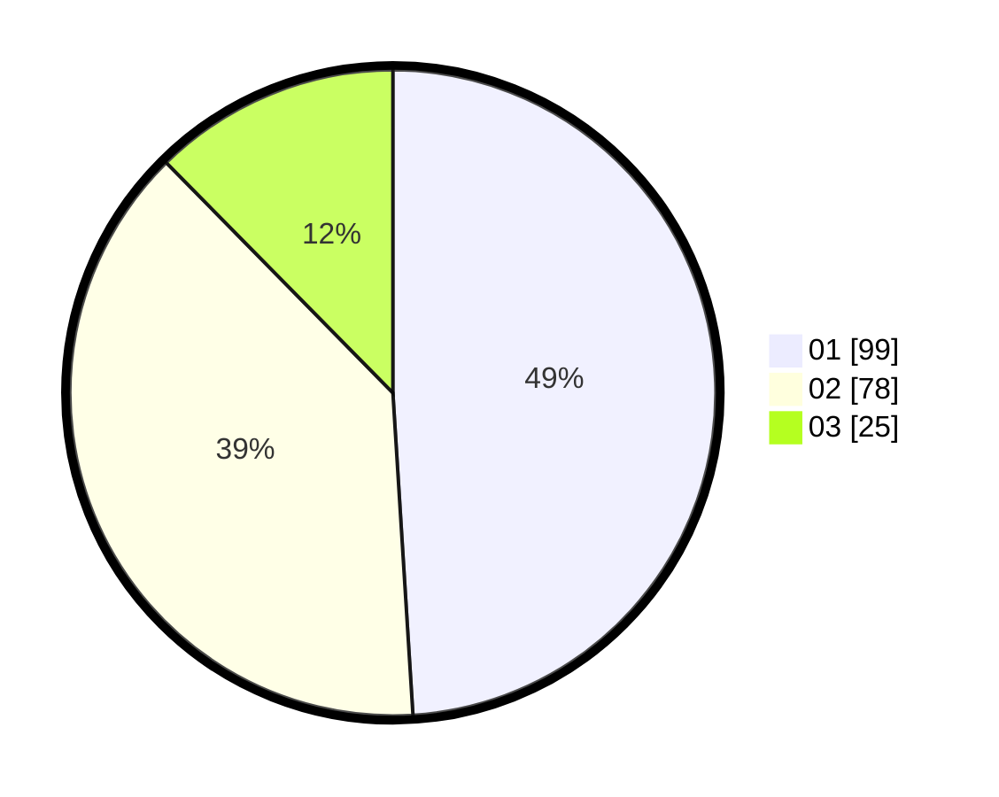

# Hasil

Hasil perolehan suara paslon dapat dilihat pada file paslon-01.txt, paslon-02.txt, dan paslon-03.txt.

Jika tidak ada, artinya data tersebut belum ada pada SIREKAP.

## Perolehan Suara

 * Paslon 01: **99**.
 * Paslon 02: **78**.
 * Paslon 03: **25**.

## Foto C Plano

https://sirekap-obj-formc.kpu.go.id/d186/pemilu/ppwp/31/71/03/10/07/3171031007060-20240216-145722--b1c33fe7-431f-4514-9027-9937ccb34f35.jpg

https://sirekap-obj-formc.kpu.go.id/d186/pemilu/ppwp/31/71/03/10/07/3171031007060-20240216-145723--703ddf76-54c7-4492-a568-035a8447326d.jpg

https://sirekap-obj-formc.kpu.go.id/d186/pemilu/ppwp/31/71/03/10/07/3171031007060-20240216-145723--03882de4-d10d-41a8-a3c2-75caf79e75f4.jpg

## DATA PEMILIH TETAP

Jumlah pemilih dalam DPT: **206**.
 * L: **100**.
 * P: **106**.

## DATA PENGGUNA HAK PILIH

Jumlah pengguna hak pilih dalam DPT: **206**.
 * L: **100**.
 * P: **106**.

Jumlah pengguna hak pilih dalam DPTb: **3**.
 * L: **2**.
 * P: **1**.

Jumlah pengguna hak pilih dalam DPK: **0**.
 * L: **0**.
 * P: **0**.

Jumlah pengguna hak pilih: **209**.
 * L: **102**.
 * P: **107**.

## JUMLAH SUARA SAH DAN TIDAK SAH

JUMLAH SELURUH SUARA SAH: **202**.

JUMLAH SUARA TIDAK SAH: **7**.

JUMLAH SELURUH SUARA SAH DAN SUARA TIDAK SAH: **209**.
