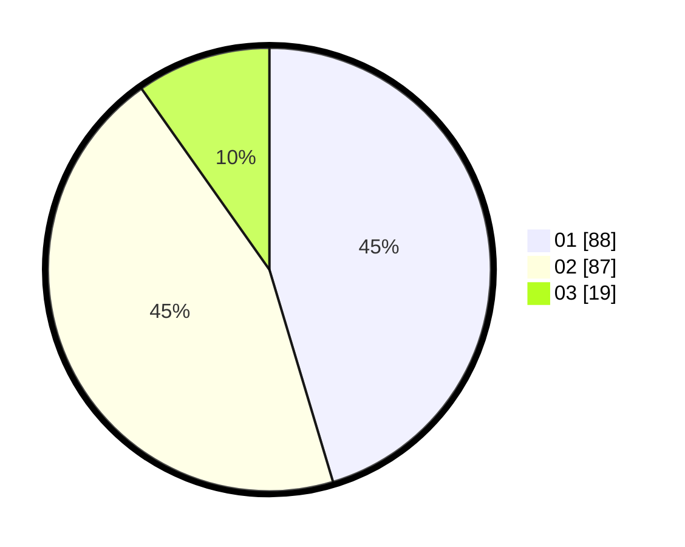

# Hasil

Hasil perolehan suara paslon dapat dilihat pada file paslon-01.txt, paslon-02.txt, dan paslon-03.txt.

Jika tidak ada, artinya data tersebut belum ada pada SIREKAP.

## Perolehan Suara

 * Paslon 01: **88**.
 * Paslon 02: **87**.
 * Paslon 03: **19**.

## Foto C Plano

https://sirekap-obj-formc.kpu.go.id/e1e9/pemilu/ppwp/31/71/03/10/07/3171031007062-20240214-192531--b6ac758e-0853-40fc-800b-52f041ffabbb.jpg

https://sirekap-obj-formc.kpu.go.id/e1e9/pemilu/ppwp/31/71/03/10/07/3171031007062-20240214-214734--a833824a-c3ef-43a2-8ee9-38211bda3a77.jpg

https://sirekap-obj-formc.kpu.go.id/e1e9/pemilu/ppwp/31/71/03/10/07/3171031007062-20240214-215407--b3b63015-9436-4c0b-ab58-18f0a7ebf374.jpg

## DATA PEMILIH TETAP

Jumlah pemilih dalam DPT: **247**.
 * L: **110**.
 * P: **137**.

## DATA PENGGUNA HAK PILIH

Jumlah pengguna hak pilih dalam DPT: **197**.
 * L: **84**.
 * P: **113**.

Jumlah pengguna hak pilih dalam DPTb: **4**.
 * L: **2**.
 * P: **2**.

Jumlah pengguna hak pilih dalam DPK: **0**.
 * L: **0**.
 * P: **0**.

Jumlah pengguna hak pilih: **201**.
 * L: **86**.
 * P: **115**.

## JUMLAH SUARA SAH DAN TIDAK SAH

JUMLAH SELURUH SUARA SAH: **194**.

JUMLAH SUARA TIDAK SAH: **7**.

JUMLAH SELURUH SUARA SAH DAN SUARA TIDAK SAH: **201**.
