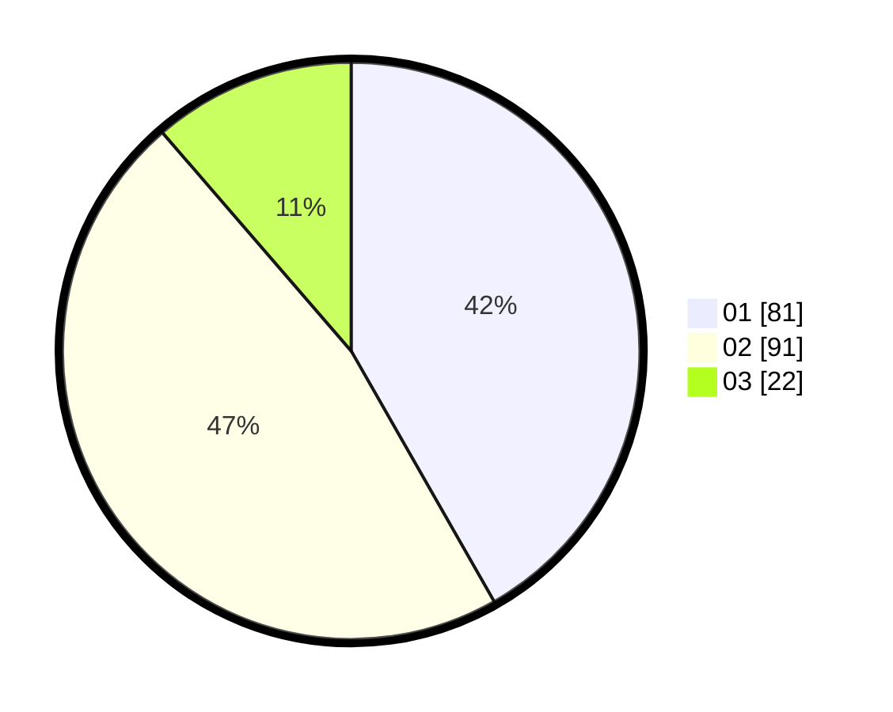

# Hasil

Hasil perolehan suara paslon dapat dilihat pada file paslon-01.txt, paslon-02.txt, dan paslon-03.txt.

Jika tidak ada, artinya data tersebut belum ada pada SIREKAP.

## Perolehan Suara

 * Paslon 01: **81**.
 * Paslon 02: **91**.
 * Paslon 03: **22**.

## Foto C Plano

https://sirekap-obj-formc.kpu.go.id/931a/pemilu/ppwp/31/71/03/10/07/3171031007065-20240215-000706--594bee01-afeb-423a-a98b-95e8b88af86b.jpg

https://sirekap-obj-formc.kpu.go.id/931a/pemilu/ppwp/31/71/03/10/07/3171031007065-20240215-001000--ea6d3760-2890-4c75-ac08-79024af78cd7.jpg

https://sirekap-obj-formc.kpu.go.id/931a/pemilu/ppwp/31/71/03/10/07/3171031007065-20240215-001053--d8a74c3e-97e9-401f-b9ad-f43f4430e589.jpg
