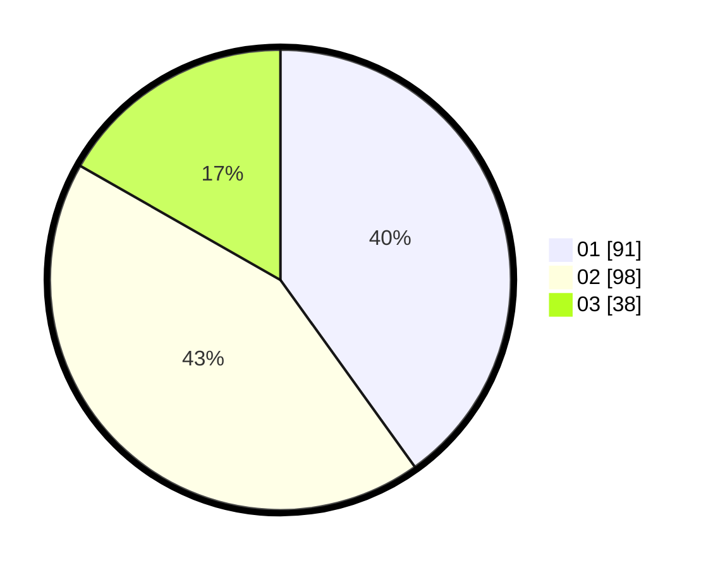

# Hasil

Hasil perolehan suara paslon dapat dilihat pada file paslon-01.txt, paslon-02.txt, dan paslon-03.txt.

Jika tidak ada, artinya data tersebut belum ada pada SIREKAP.

## Perolehan Suara

 * Paslon 01: **91**.
 * Paslon 02: **98**.
 * Paslon 03: **38**.

## Foto C Plano

https://sirekap-obj-formc.kpu.go.id/00bd/pemilu/ppwp/31/71/03/10/07/3171031007067-20240216-121731--9b5e072b-7292-4024-812a-36f9853a4f17.jpg

https://sirekap-obj-formc.kpu.go.id/00bd/pemilu/ppwp/31/71/03/10/07/3171031007067-20240216-121742--b9012682-cf92-40bb-8793-83a24b2f91ad.jpg

https://sirekap-obj-formc.kpu.go.id/00bd/pemilu/ppwp/31/71/03/10/07/3171031007067-20240216-121736--238dbda6-f87d-48fd-8899-dc03d8cb47d9.jpg

## DATA PEMILIH TETAP

Jumlah pemilih dalam DPT: **287**.
 * L: **141**.
 * P: **146**.

## DATA PENGGUNA HAK PILIH

Jumlah pengguna hak pilih dalam DPT: **224**.
 * L: **115**.
 * P: **109**.

Jumlah pengguna hak pilih dalam DPTb: **3**.
 * L: **0**.
 * P: **3**.

Jumlah pengguna hak pilih dalam DPK: **2**.
 * L: **1**.
 * P: **1**.

Jumlah pengguna hak pilih: **229**.
 * L: **116**.
 * P: **113**.

## JUMLAH SUARA SAH DAN TIDAK SAH

JUMLAH SELURUH SUARA SAH: **227**.

JUMLAH SUARA TIDAK SAH: **2**.

JUMLAH SELURUH SUARA SAH DAN SUARA TIDAK SAH: **229**.
