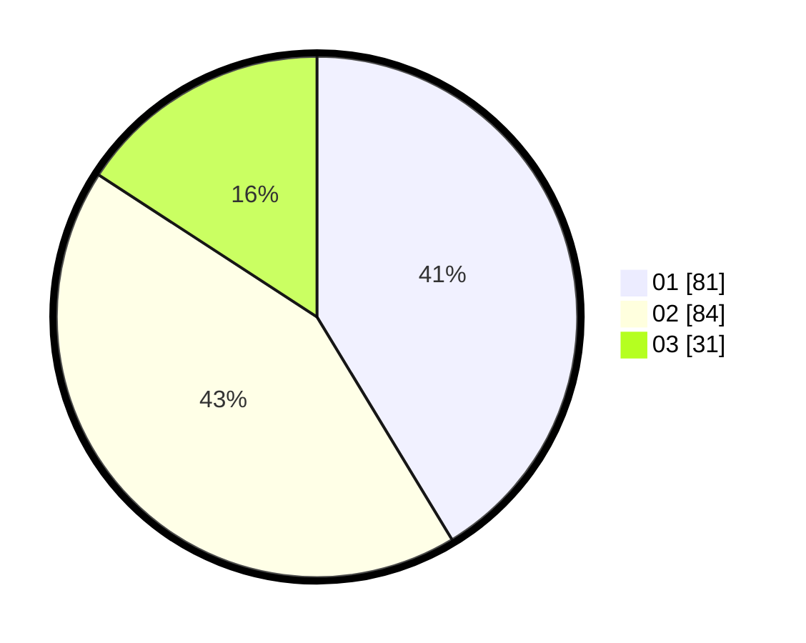

# Hasil

Hasil perolehan suara paslon dapat dilihat pada file paslon-01.txt, paslon-02.txt, dan paslon-03.txt.

Jika tidak ada, artinya data tersebut belum ada pada SIREKAP.

## Perolehan Suara

 * Paslon 01: **81**.
 * Paslon 02: **84**.
 * Paslon 03: **31**.

## Foto C Plano

https://sirekap-obj-formc.kpu.go.id/e99d/pemilu/ppwp/31/71/03/10/07/3171031007068-20240215-015108--351a437e-4a24-48d1-bf9d-0fbef3ce1bde.jpg

https://sirekap-obj-formc.kpu.go.id/e99d/pemilu/ppwp/31/71/03/10/07/3171031007068-20240215-015134--f73f4b63-68af-4f0c-80ec-e06fd7464c91.jpg

https://sirekap-obj-formc.kpu.go.id/e99d/pemilu/ppwp/31/71/03/10/07/3171031007068-20240215-015120--fdea3660-8071-449d-93c4-33cdc9a218d0.jpg

## DATA PEMILIH TETAP

Jumlah pemilih dalam DPT: **284**.
 * L: **144**.
 * P: **140**.

## DATA PENGGUNA HAK PILIH

Jumlah pengguna hak pilih dalam DPT: **194**.
 * L: **101**.
 * P: **93**.

Jumlah pengguna hak pilih dalam DPTb: **6**.
 * L: **0**.
 * P: **6**.

Jumlah pengguna hak pilih dalam DPK: **0**.
 * L: **0**.
 * P: **0**.

Jumlah pengguna hak pilih: **200**.
 * L: **101**.
 * P: **99**.

## JUMLAH SUARA SAH DAN TIDAK SAH

JUMLAH SELURUH SUARA SAH: **196**.

JUMLAH SUARA TIDAK SAH: **4**.

JUMLAH SELURUH SUARA SAH DAN SUARA TIDAK SAH: **4**.
