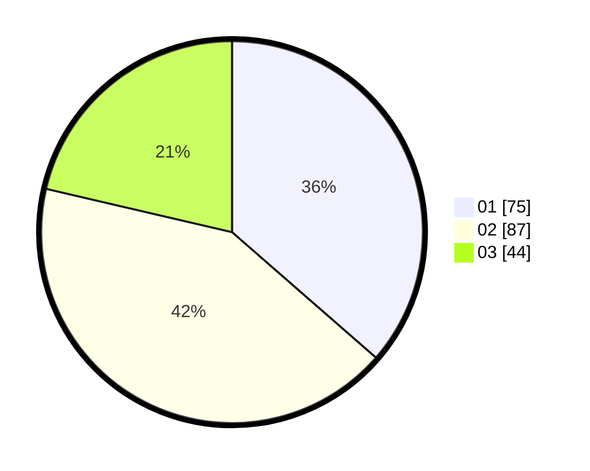

# Hasil

Hasil perolehan suara paslon dapat dilihat pada file paslon-01.txt, paslon-02.txt, dan paslon-03.txt.

Jika tidak ada, artinya data tersebut belum ada pada SIREKAP.

## Perolehan Suara

 * Paslon 01: **75**.
 * Paslon 02: **87**.
 * Paslon 03: **44**.

## Foto C Plano

https://sirekap-obj-formc.kpu.go.id/e318/pemilu/ppwp/31/71/03/10/07/3171031007070-20240214-155547--ced593fb-d5da-4fbb-a167-6bb8560440d1.jpg

https://sirekap-obj-formc.kpu.go.id/e318/pemilu/ppwp/31/71/03/10/07/3171031007070-20240214-155040--7e1614d4-e9a2-4e1c-b442-807d489c44f7.jpg

https://sirekap-obj-formc.kpu.go.id/e318/pemilu/ppwp/31/71/03/10/07/3171031007070-20240214-155426--46682330-4b69-4e99-aea4-327426bbaaae.jpg

## DATA PEMILIH TETAP

Jumlah pemilih dalam DPT: **289**.
 * L: **140**.
 * P: **149**.

## DATA PENGGUNA HAK PILIH

Jumlah pengguna hak pilih dalam DPT: **201**.
 * L: **91**.
 * P: **110**.

Jumlah pengguna hak pilih dalam DPTb: **11**.
 * L: **9**.
 * P: **2**.

Jumlah pengguna hak pilih dalam DPK: **4**.
 * L: **2**.
 * P: **2**.

Jumlah pengguna hak pilih: **216**.
 * L: **102**.
 * P: **114**.

## JUMLAH SUARA SAH DAN TIDAK SAH

JUMLAH SELURUH SUARA SAH: **206**.

JUMLAH SUARA TIDAK SAH: **10**.

JUMLAH SELURUH SUARA SAH DAN SUARA TIDAK SAH: **216**.
