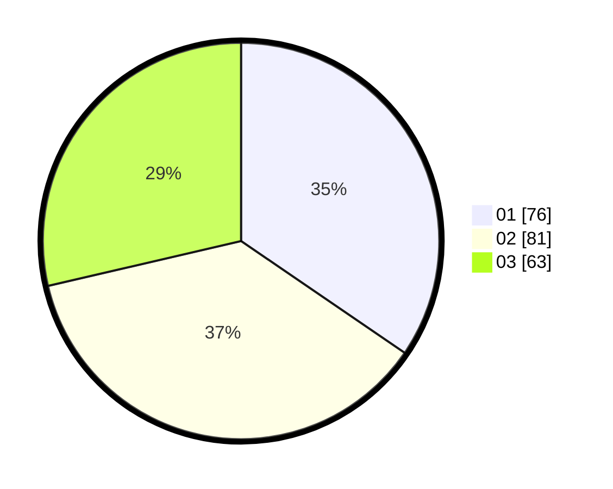

# Hasil

Hasil perolehan suara paslon dapat dilihat pada file paslon-01.txt, paslon-02.txt, dan paslon-03.txt.

Jika tidak ada, artinya data tersebut belum ada pada SIREKAP.

## Perolehan Suara

 * Paslon 01: **76**.
 * Paslon 02: **81**.
 * Paslon 03: **63**.

## Foto C Plano

https://sirekap-obj-formc.kpu.go.id/db35/pemilu/ppwp/31/71/03/10/07/3171031007072-20240216-140740--1d02c981-91a8-4b62-aae4-09b18b0fb067.jpg

https://sirekap-obj-formc.kpu.go.id/db35/pemilu/ppwp/31/71/03/10/07/3171031007072-20240216-140741--a5f57b05-2d15-492b-8f79-a4a9eb32d68b.jpg

https://sirekap-obj-formc.kpu.go.id/db35/pemilu/ppwp/31/71/03/10/07/3171031007072-20240216-140741--032b91bd-cfa6-4d70-8139-abf7955d76a5.jpg

## DATA PEMILIH TETAP

Jumlah pemilih dalam DPT: **230**.
 * L: **109**.
 * P: **121**.

## DATA PENGGUNA HAK PILIH

Jumlah pengguna hak pilih dalam DPT: **219**.
 * L: **102**.
 * P: **117**.

Jumlah pengguna hak pilih dalam DPTb: **6**.
 * L: **5**.
 * P: **1**.

Jumlah pengguna hak pilih dalam DPK: **5**.
 * L: **2**.
 * P: **3**.

Jumlah pengguna hak pilih: **230**.
 * L: **109**.
 * P: **121**.

## JUMLAH SUARA SAH DAN TIDAK SAH

JUMLAH SELURUH SUARA SAH: **220**.

JUMLAH SUARA TIDAK SAH: **10**.

JUMLAH SELURUH SUARA SAH DAN SUARA TIDAK SAH: **230**.
