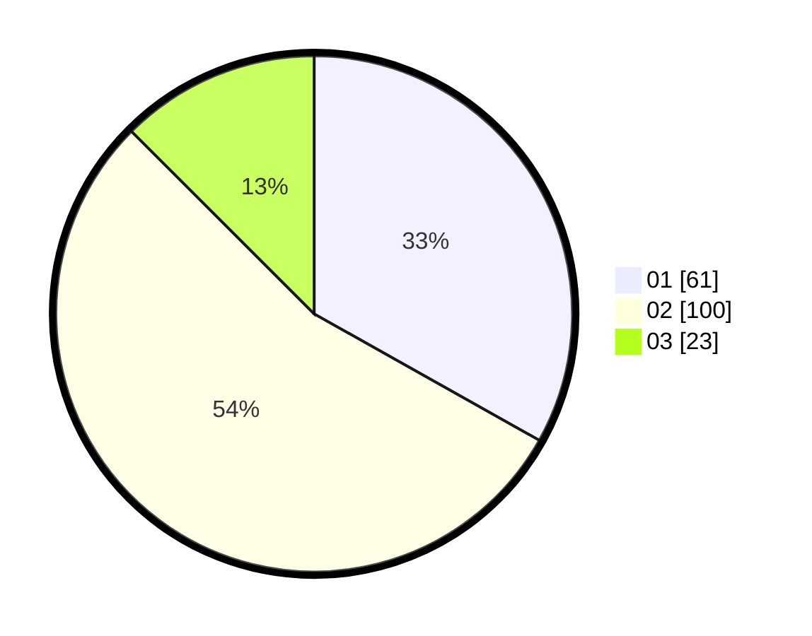

# Hasil

Hasil perolehan suara paslon dapat dilihat pada file paslon-01.txt, paslon-02.txt, dan paslon-03.txt.

Jika tidak ada, artinya data tersebut belum ada pada SIREKAP.

## Perolehan Suara

 * Paslon 01: **61**.
 * Paslon 02: **100**.
 * Paslon 03: **23**.

## Foto C Plano

https://sirekap-obj-formc.kpu.go.id/8d52/pemilu/ppwp/31/71/03/10/07/3171031007073-20240217-103043--dcf06561-4a32-4b00-a97a-1064a6535029.jpg

https://sirekap-obj-formc.kpu.go.id/8d52/pemilu/ppwp/31/71/03/10/07/3171031007073-20240217-103044--5aae1289-3236-4b0f-98b3-d27229c55496.jpg

https://sirekap-obj-formc.kpu.go.id/8d52/pemilu/ppwp/31/71/03/10/07/3171031007073-20240217-103044--bbb415a0-4a4f-4756-aede-f18659b723fe.jpg

## DATA PEMILIH TETAP

Jumlah pemilih dalam DPT: **233**.
 * L: **114**.
 * P: **119**.

## DATA PENGGUNA HAK PILIH

Jumlah pengguna hak pilih dalam DPT: **186**.
 * L: **89**.
 * P: **97**.

Jumlah pengguna hak pilih dalam DPTb: **0**.
 * L: **0**.
 * P: **0**.

Jumlah pengguna hak pilih dalam DPK: **0**.
 * L: **0**.
 * P: **0**.

Jumlah pengguna hak pilih: **186**.
 * L: **89**.
 * P: **97**.

## JUMLAH SUARA SAH DAN TIDAK SAH

JUMLAH SELURUH SUARA SAH: **184**.

JUMLAH SUARA TIDAK SAH: **2**.

JUMLAH SELURUH SUARA SAH DAN SUARA TIDAK SAH: **186**.
