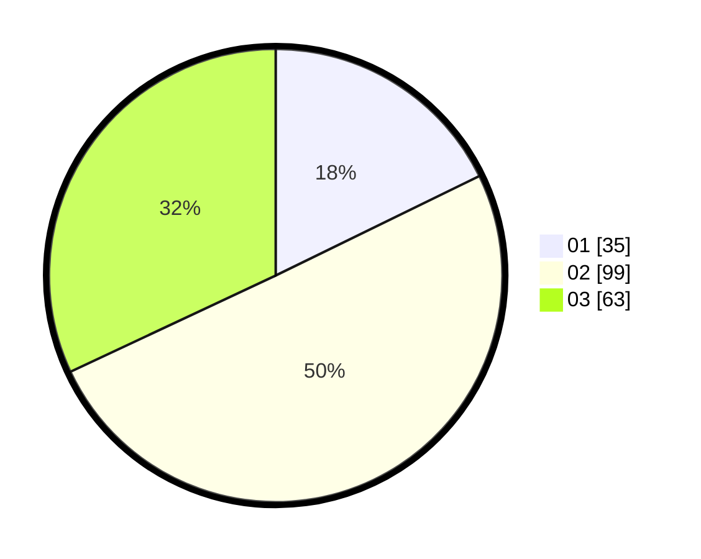

# Hasil

Hasil perolehan suara paslon dapat dilihat pada file paslon-01.txt, paslon-02.txt, dan paslon-03.txt.

Jika tidak ada, artinya data tersebut belum ada pada SIREKAP.

## Perolehan Suara

 * Paslon 01: **35**.
 * Paslon 02: **99**.
 * Paslon 03: **63**.

## Foto C Plano

https://sirekap-obj-formc.kpu.go.id/bbb0/pemilu/ppwp/31/71/03/10/07/3171031007076-20240214-202812--8313721b-8fa2-4140-8e36-84ffda4ee391.jpg

https://sirekap-obj-formc.kpu.go.id/bbb0/pemilu/ppwp/31/71/03/10/07/3171031007076-20240214-202828--bbde20f5-98a5-42a2-84cf-73a074d0e64e.jpg

https://sirekap-obj-formc.kpu.go.id/bbb0/pemilu/ppwp/31/71/03/10/07/3171031007076-20240214-202850--8376297c-7e5f-4daa-8fc8-b53e485f75c3.jpg

## DATA PEMILIH TETAP

Jumlah pemilih dalam DPT: **291**.
 * L: **142**.
 * P: **149**.

## DATA PENGGUNA HAK PILIH

Jumlah pengguna hak pilih dalam DPT: **174**.
 * L: **79**.
 * P: **95**.

Jumlah pengguna hak pilih dalam DPTb: **17**.
 * L: **4**.
 * P: **13**.

Jumlah pengguna hak pilih dalam DPK: **8**.
 * L: **5**.
 * P: **3**.

Jumlah pengguna hak pilih: **199**.
 * L: **88**.
 * P: **111**.

## JUMLAH SUARA SAH DAN TIDAK SAH

JUMLAH SELURUH SUARA SAH: **197**.

JUMLAH SUARA TIDAK SAH: **2**.

JUMLAH SELURUH SUARA SAH DAN SUARA TIDAK SAH: **199**.
