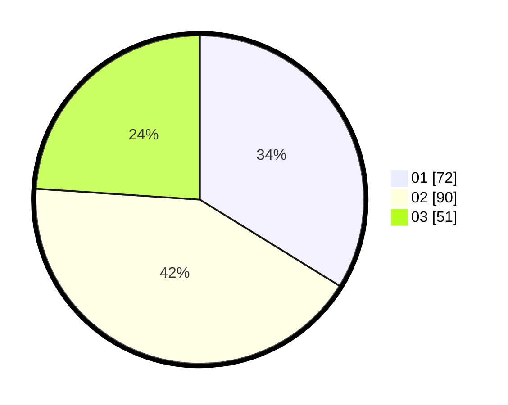

# Hasil

Hasil perolehan suara paslon dapat dilihat pada file paslon-01.txt, paslon-02.txt, dan paslon-03.txt.

Jika tidak ada, artinya data tersebut belum ada pada SIREKAP.

## Perolehan Suara

 * Paslon 01: **72**.
 * Paslon 02: **90**.
 * Paslon 03: **51**.

## Foto C Plano

https://sirekap-obj-formc.kpu.go.id/66a7/pemilu/ppwp/31/71/03/10/08/3171031008004-20240216-190454--7fa5034a-66e4-4dac-8851-6d6902170833.jpg

https://sirekap-obj-formc.kpu.go.id/66a7/pemilu/ppwp/31/71/03/10/08/3171031008004-20240216-190456--e097f9ed-59a6-49a9-a3c9-0467eed24ab3.jpg

https://sirekap-obj-formc.kpu.go.id/66a7/pemilu/ppwp/31/71/03/10/08/3171031008004-20240216-190455--bb34c6e7-d3ab-4691-9933-a237915b87bb.jpg

## DATA PEMILIH TETAP

Jumlah pemilih dalam DPT: **276**.
 * L: **136**.
 * P: **140**.

## DATA PENGGUNA HAK PILIH

Jumlah pengguna hak pilih dalam DPT: **209**.
 * L: **106**.
 * P: **103**.

Jumlah pengguna hak pilih dalam DPTb: **4**.
 * L: **2**.
 * P: **2**.

Jumlah pengguna hak pilih dalam DPK: **2**.
 * L: **2**.
 * P: **0**.

Jumlah pengguna hak pilih: **215**.
 * L: **110**.
 * P: **105**.

## JUMLAH SUARA SAH DAN TIDAK SAH

JUMLAH SELURUH SUARA SAH: **213**.

JUMLAH SUARA TIDAK SAH: **2**.

JUMLAH SELURUH SUARA SAH DAN SUARA TIDAK SAH: **215**.
