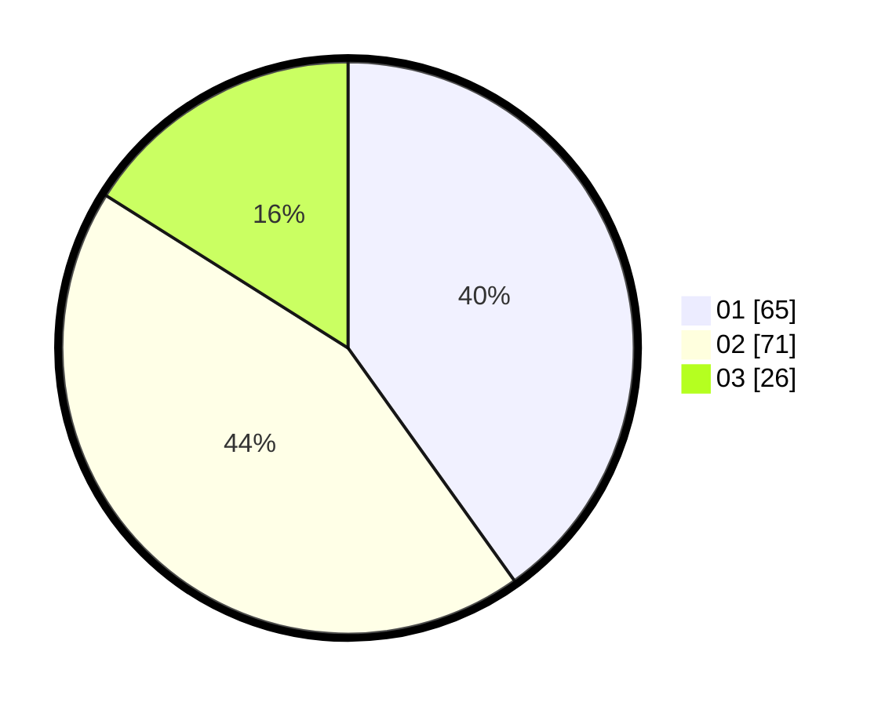

# Hasil

Hasil perolehan suara paslon dapat dilihat pada file paslon-01.txt, paslon-02.txt, dan paslon-03.txt.

Jika tidak ada, artinya data tersebut belum ada pada SIREKAP.

## Perolehan Suara

 * Paslon 01: **65**.
 * Paslon 02: **71**.
 * Paslon 03: **26**.

## Foto C Plano

https://sirekap-obj-formc.kpu.go.id/fcc5/pemilu/ppwp/31/71/03/10/08/3171031008018-20240216-152542--a4535701-92a3-4330-a8f6-7cba755c868f.jpg

https://sirekap-obj-formc.kpu.go.id/fcc5/pemilu/ppwp/31/71/03/10/08/3171031008018-20240216-152543--7cfb7fe7-2e36-47a5-a913-02e7490db1d0.jpg

https://sirekap-obj-formc.kpu.go.id/fcc5/pemilu/ppwp/31/71/03/10/08/3171031008018-20240215-031424--975291c8-a39f-4f51-ab4f-7ef6e36f60e1.jpg

## DATA PEMILIH TETAP

Jumlah pemilih dalam DPT: **268**.
 * L: **131**.
 * P: **137**.

## DATA PENGGUNA HAK PILIH

Jumlah pengguna hak pilih dalam DPT: **162**.
 * L: **76**.
 * P: **86**.

Jumlah pengguna hak pilih dalam DPTb: **2**.
 * L: **1**.
 * P: **1**.

Jumlah pengguna hak pilih dalam DPK: **2**.
 * L: **1**.
 * P: **1**.

Jumlah pengguna hak pilih: **166**.
 * L: **78**.
 * P: **88**.

## JUMLAH SUARA SAH DAN TIDAK SAH

JUMLAH SELURUH SUARA SAH: **162**.

JUMLAH SUARA TIDAK SAH: **4**.

JUMLAH SELURUH SUARA SAH DAN SUARA TIDAK SAH: **166**.
