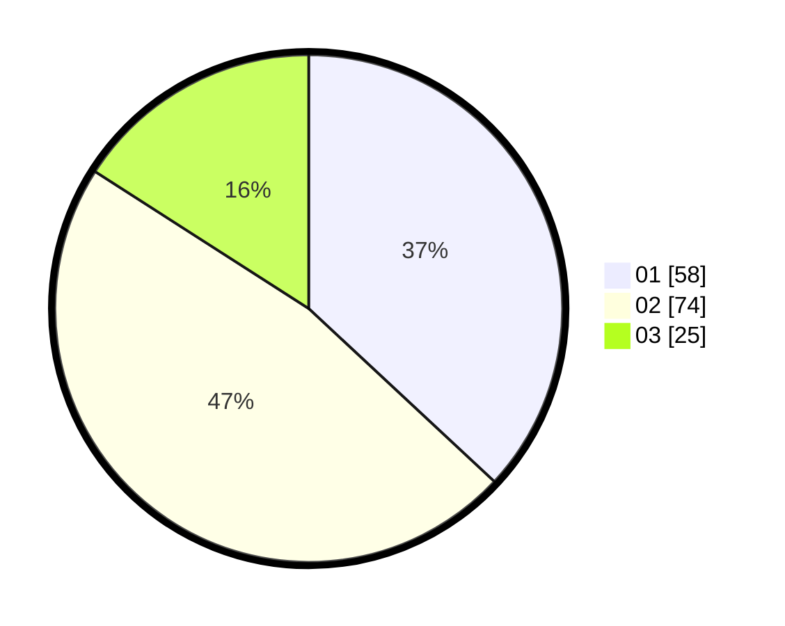

# Hasil

Hasil perolehan suara paslon dapat dilihat pada file paslon-01.txt, paslon-02.txt, dan paslon-03.txt.

Jika tidak ada, artinya data tersebut belum ada pada SIREKAP.

## Perolehan Suara

 * Paslon 01: **58**.
 * Paslon 02: **74**.
 * Paslon 03: **25**.

## Foto C Plano

https://sirekap-obj-formc.kpu.go.id/eba2/pemilu/ppwp/31/71/03/10/08/3171031008019-20240216-195836--6cb604fa-1af1-4e44-b958-29e583d9d9e1.jpg

https://sirekap-obj-formc.kpu.go.id/eba2/pemilu/ppwp/31/71/03/10/08/3171031008019-20240216-131445--efbdfd26-f177-4f57-a720-b5549dfa1cee.jpg

https://sirekap-obj-formc.kpu.go.id/eba2/pemilu/ppwp/31/71/03/10/08/3171031008019-20240216-131444--9e24dc1f-3431-4677-a32b-4b970ca01c11.jpg

## DATA PEMILIH TETAP

Jumlah pemilih dalam DPT: **268**.
 * L: **134**.
 * P: **134**.

## DATA PENGGUNA HAK PILIH

Jumlah pengguna hak pilih dalam DPT: **157**.
 * L: **72**.
 * P: **85**.

Jumlah pengguna hak pilih dalam DPTb: **1**.
 * L: **1**.
 * P: **0**.

Jumlah pengguna hak pilih dalam DPK: **1**.
 * L: **0**.
 * P: **1**.

Jumlah pengguna hak pilih: **159**.
 * L: **73**.
 * P: **86**.

## JUMLAH SUARA SAH DAN TIDAK SAH

JUMLAH SELURUH SUARA SAH: **157**.

JUMLAH SUARA TIDAK SAH: **2**.

JUMLAH SELURUH SUARA SAH DAN SUARA TIDAK SAH: **159**.
