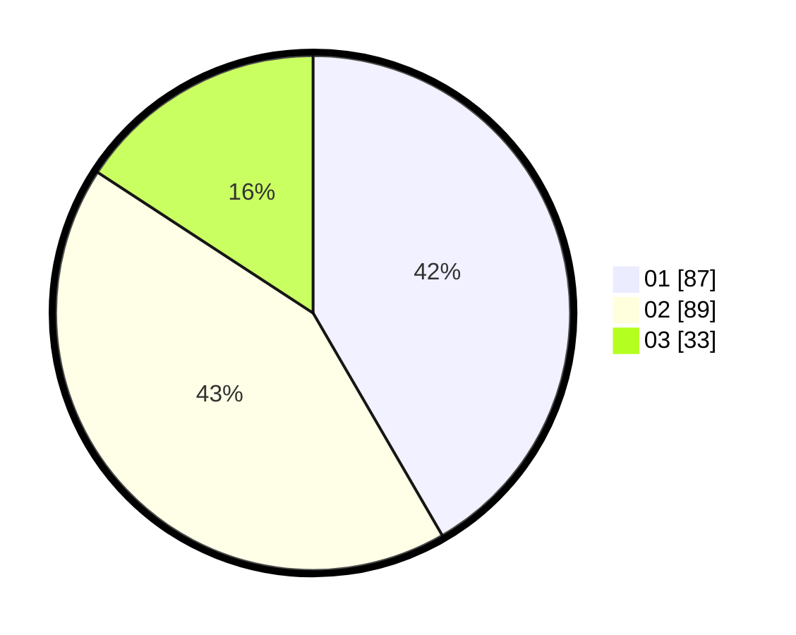

# Hasil

Hasil perolehan suara paslon dapat dilihat pada file paslon-01.txt, paslon-02.txt, dan paslon-03.txt.

Jika tidak ada, artinya data tersebut belum ada pada SIREKAP.

## Perolehan Suara

 * Paslon 01: **87**.
 * Paslon 02: **89**.
 * Paslon 03: **33**.

## Foto C Plano

https://sirekap-obj-formc.kpu.go.id/4a05/pemilu/ppwp/31/71/03/10/08/3171031008021-20240216-150320--83b3f59e-766c-4289-8a4d-4b3f79b4f170.jpg

https://sirekap-obj-formc.kpu.go.id/4a05/pemilu/ppwp/31/71/03/10/08/3171031008021-20240216-150321--e0dfb123-8593-4cc0-ad6c-4c19b327898b.jpg

https://sirekap-obj-formc.kpu.go.id/4a05/pemilu/ppwp/31/71/03/10/08/3171031008021-20240216-150320--f90236db-9eaf-4ece-841b-cd334241268f.jpg

## DATA PEMILIH TETAP

Jumlah pemilih dalam DPT: **278**.
 * L: **148**.
 * P: **130**.

## DATA PENGGUNA HAK PILIH

Jumlah pengguna hak pilih dalam DPT: **209**.
 * L: **110**.
 * P: **99**.

Jumlah pengguna hak pilih dalam DPTb: **2**.
 * L: **0**.
 * P: **2**.

Jumlah pengguna hak pilih dalam DPK: **2**.
 * L: **1**.
 * P: **1**.

Jumlah pengguna hak pilih: **213**.
 * L: **111**.
 * P: **102**.

## JUMLAH SUARA SAH DAN TIDAK SAH

JUMLAH SELURUH SUARA SAH: **209**.

JUMLAH SUARA TIDAK SAH: **4**.

JUMLAH SELURUH SUARA SAH DAN SUARA TIDAK SAH: **213**.
